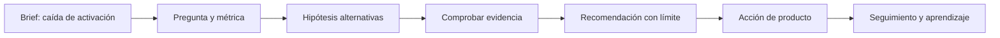

# El rol del analista, tipos de análisis y ciclo de decisión

## Resultado observable y punto de partida

Al terminar podrás recibir una frase como «la activación ha caído» y convertirla en un recorrido de investigación. Distinguirás cuatro tipos de análisis sin confundir una descripción con una causa o una recomendación. No necesitas saber programar: una **app** es un programa que una persona usa en su teléfono; un **evento** será una acción que la app registra, como instalarla o completar una reserva.

## Caso continuo: la caída de activación de Lumen

Lumen permite reservar puestos de trabajo. El lunes, la responsable de producto escribe: «La activación ha bajado; arregladlo». Antes de actuar faltan datos importantes.

Llamaremos **activación** a que una persona nueva llega a realizar la primera acción de valor del producto. En Lumen, de momento, esa acción será completar una primera reserva. Esta definición es una elección de negocio, no una propiedad mágica del software: más adelante se formalizará para que todos cuenten lo mismo.

El encargo útil no es «mirar los datos». Es decidir entre opciones con coste: ¿priorizar una incidencia de ingeniería en el formulario?, ¿cambiar el texto de bienvenida?, ¿pausar una campaña que atrae usuarios poco adecuados?, ¿esperar porque la caída es solo una variación normal? El analista hace visible qué evidencia haría preferible una opción.

## Del brief al seguimiento

Este flujo responde a «¿qué debe ocurrir entre una alarma y una decisión responsable?».

El seguimiento vuelve a abrir una pregunta, aunque lo representemos como el final de este recorrido para conservar un diagrama legible en PDF. Si Lumen simplifica una pantalla, debe comprobar después si sube la activación **sin** empeorar cancelaciones, soporte o ingresos. Una recomendación no cierra el análisis; crea una nueva situación que hay que observar.

## Cuatro preguntas, cuatro tipos de análisis

La misma caída puede estudiarse con preguntas distintas. La tabla no es una escalera automática: cada tipo necesita evidencia diferente.

| Tipo | Pregunta de Lumen | Entrega útil | Lo que no permite afirmar por sí solo |
| --- | --- | --- | --- |
| Descriptivo | ¿Cuánto cambió la activación y en qué fechas? | Serie, segmentos y definición de la medida | Por qué cambió ni qué hacer |
| Diagnóstico | ¿En qué paso, dispositivo o canal se concentra la caída? | Hipótesis priorizadas y comprobaciones | Que un factor observado sea la causa |
| Predictivo | ¿Cuántas activaciones esperamos la próxima semana si continúa el patrón? | Estimación con incertidumbre | Que una acción concreta produzca el resultado |
| Prescriptivo | ¿Qué opción conviene ejecutar dadas las evidencias, costes y riesgos? | Recomendación, condiciones y seguimiento | Que sea óptima o causalmente demostrada sin experimento |

En lectura rápida, el análisis **descriptivo** responde «qué pasó»; el **diagnóstico** pregunta «dónde y con qué explicaciones plausibles»; el **predictivo** estima «qué podría pasar»; y el **prescriptivo** propone «qué conviene hacer, bajo qué condiciones y cómo sabremos si funcionó». Ninguno autoriza por sí solo a afirmar causalidad.

### Ejemplo trabajado

La primera comprobación muestra que la activación pasó de 38% a 29% entre dos semanas comparables. Eso es **descriptivo**. Al separar por plataforma, la caída aparece sobre todo en Android y coincide con una actualización. Eso es **diagnóstico exploratorio**: orienta a revisar el formulario y los registros de error, pero aún no prueba que la actualización sea la causa. Si Lumen estima el número de activaciones de la semana siguiente para dimensionar soporte, está haciendo una **predicción**. Si decide revertir la actualización temporalmente porque el riesgo de perder usuarios es alto y medirá el efecto, está haciendo una **prescripción** bajo incertidumbre.

### Contraejemplos que evitan errores caros

- «Android cayó después de la actualización; por tanto, la actualización causó la caída». Es una hipótesis plausible, no una prueba. También pudo cambiar la mezcla de campañas o dejar de registrarse un evento.
- «El modelo predice 600 activaciones; por tanto, cambiar el botón dará 600». Una predicción de demanda no mide el efecto causal de un cambio de interfaz.
- «Recomiendo cambiar el texto porque parece claro». Una recomendación sin métrica de éxito, coste o plan de reversión es una opinión, no una decisión analítica.

## El producto real del analista

Un gráfico puede ser una evidencia, pero no es el producto final. Una entrega profesional deja una cadena que otra persona puede revisar:

- **Decisión:** qué se puede hacer y quién decide.
- **Pregunta:** qué comparación responderá esa decisión.
- **Evidencia:** qué registros, periodos y comprobaciones la sostienen.
- **Interpretación:** qué muestra el resultado y qué permanece incierto.
- **Recomendación:** acción, coste, riesgo y criterio de seguimiento.

Esta cadena protege tanto a Lumen como al analista: evita que una cifra bonita se convierta en una afirmación que los datos no permiten.

## Resumen y comprobación

- Describir, diagnosticar, predecir y prescribir responden preguntas distintas.
- Una asociación observada puede priorizar una investigación, pero no demuestra causalidad.
- Toda acción debe tener una métrica de seguimiento y una posible condición de reversión.

Comprueba tu comprensión: si la activación baja solo en Android, ¿qué dos explicaciones alternativas investigarías antes de culpar al formulario? ¿Qué dato distinguiría una caída real de un fallo de medición?

En la siguiente lección convertirás la alarma de Lumen en una pregunta comprobable y un contrato de métrica. Después resuelve el [caso integrador](../../../ejercicios/temario-00/comprension/preguntas.md).
