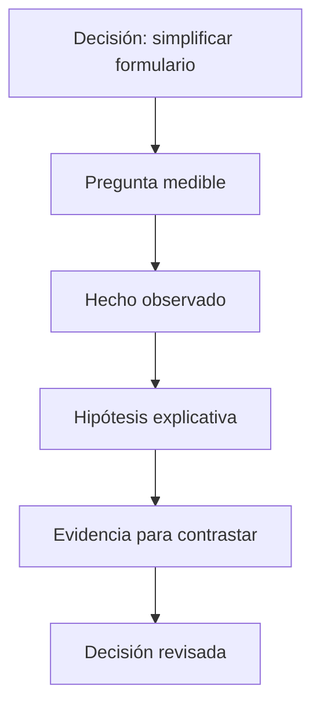

# Preguntas, hipótesis, evidencia y métricas

## Objetivos y prerrequisitos

Aprenderás a convertir una petición ambigua en una pregunta medible, a separar una hipótesis de un hecho y a pedir una métrica bien definida. Parte de la lección anterior; no requiere matemáticas avanzadas.

## Una pregunta que se pueda comprobar

“Queremos que más personas usen la aplicación” expresa un deseo, no una pregunta. Para que un equipo pueda investigar necesita concretar cuatro piezas: la **población** (quiénes), el **resultado** que se observa, el **periodo** y la **comparación**.

Ejemplo: “Entre quienes instalaron la aplicación en mayo, ¿qué porcentaje completó su primera reserva en siete días, frente a quienes la instalaron en abril?”. Ya se puede buscar evidencia, y también se puede discutir si siete días es una ventana razonable.

## Hecho, hipótesis y evidencia

Una **hipótesis** es una explicación provisional que podría ser falsa: “el formulario largo reduce las reservas”. La **evidencia** es la información que apoya o cuestiona esa explicación: registros de pasos completados, una comparación entre versiones o entrevistas. Un resultado observado es: “solo el 42 % llega al último paso”. No confundas el resultado con su causa.

Este mapa responde a “¿qué hay que mantener separado para razonar con rigor?”

La flecha no convierte una hipótesis en verdad. La evidencia puede hacerla más plausible, descartarla o mostrar que faltan datos.

## Qué significa “métrica”

Una **métrica** es una medida cuya regla se puede repetir. “Usuarios activos” no basta si nadie sabe si cuenta una apertura de la app, una reserva, un día o un mes. Una definición mínima incluye fórmula, población, periodo, fuente y responsable.

Por ejemplo: “tasa de primera reserva a siete días = personas que reservan en los siete días posteriores a instalar / personas que instalan, para instalaciones de mayo, excluyendo cuentas de prueba”. Otra persona debe llegar al mismo número al aplicar la misma regla.

Un **KPI** es una métrica elegida para seguir un objetivo importante. No todo número es KPI: si una métrica no orienta una decisión, quizá es ruido o contexto, no una prioridad.

## Error habitual: optimizar el número equivocado

Si se premia solo “reservas creadas”, un equipo podría facilitar reservas que luego se cancelan. Por eso una métrica principal suele necesitar una métrica de protección: junto a reservas, vigilar cancelaciones, reclamaciones o margen. Este riesgo se retomará al diseñar árboles de métricas.

## Resumen y práctica

- Una pregunta comprobable delimita población, resultado, periodo y comparación.
- Una hipótesis explica provisionalmente; la evidencia la contrasta.
- Una métrica reproducible tiene una definición, no solo un nombre.

Redacta una pregunta sobre el uso de una app y añade una hipótesis alternativa que también pudiera explicar el resultado. Después completa [los ejercicios](../../../ejercicios/temario-00/comprension/preguntas.md).
