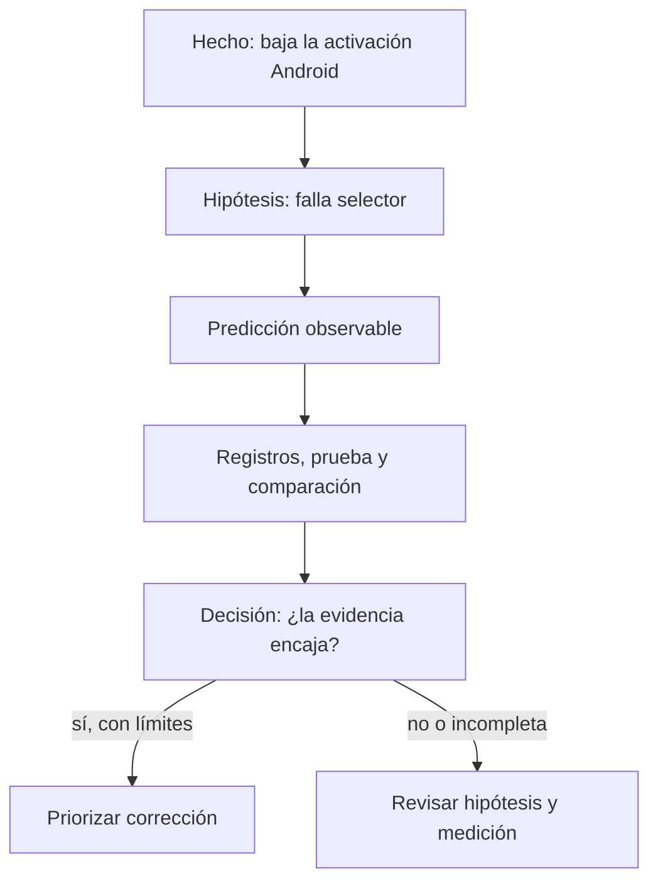

# Preguntas, hipótesis, evidencia y contrato de métrica

## Resultado observable y prerrequisitos

Al terminar redactarás una pregunta analítica y el contrato completo de una métrica de activación. Usarás el caso de Lumen de la lección anterior. Una **métrica** es una regla repetible para medir algo; un **KPI** es una métrica elegida para seguir un objetivo importante. No toda cifra merece ser KPI.

## De una preocupación a una pregunta comprobable

«Queremos que más personas usen la aplicación» expresa una intención, no una investigación. Una pregunta comprobable especifica, como mínimo:

- **Población:** ¿de qué personas o casos hablamos?
- **Resultado:** ¿qué acción o valor observaremos?
- **Ventana temporal:** ¿cuánto tiempo tiene cada persona para lograrlo?
- **Comparación:** ¿frente a qué fecha, segmento o versión?
- **Decisión:** ¿qué acción puede cambiar la respuesta?

Para Lumen: «Entre las personas que instalan la versión 4.2 de Lumen, ¿qué porcentaje completa una primera reserva dentro de siete días, comparado con la versión 4.1, y en qué paso del flujo se concentra la diferencia para decidir si revertimos el cambio?».

La pregunta no presupone que la versión sea culpable. Ese detalle permite que la evidencia contradiga la sospecha inicial.

## Hecho, hipótesis y evidencia: mantener las piezas separadas

Una **hipótesis** es una explicación provisional que podría ser falsa; por ejemplo: «el selector de fecha de Android impide avanzar». Un **hecho observado** sería: «en Android, el 31% llega a `reserva_iniciada`, frente al 43% antes de la versión». La **evidencia** es la información que puede apoyar, matizar o refutar la hipótesis: registros de error, repetición del flujo, una comparación con iOS o una prueba controlada.

Este diagrama responde a «¿cómo evitar que una sospecha se disfrace de conclusión?».

La ruta «sí» no elimina los límites: quizá el cambio coincide con una campaña. Por eso la recomendación debe indicar el nivel de seguridad y qué se medirá tras actuar.

## Contrato completo de métrica

Decir «la activación es 29%» es insuficiente. Dos personas pueden llegar a números distintos si una cuenta instalaciones y otra cuentas, o si una incluye empleados de Lumen. Un **contrato de métrica** documenta las reglas antes de discutir el resultado.

| Campo | Contrato de activación de Lumen | Por qué evita errores |
| --- | --- | --- |
| Nombre y decisión | Activación a 7 días; decidir si investigar/revertir cambios de onboarding | Conecta medida y acción |
| Evento numerador | Usuarios únicos con `reserva_completada` dentro de 7 días tras instalar | Dice qué éxito cuenta |
| Denominador | Usuarios únicos con `app_instalada` en la versión y periodo definidos | Evita dividir por una población distinta |
| Exclusiones | Empleados, cuentas de prueba, fraudes detectados y reinstalaciones identificadas | Evita inflar o sesgar la tasa |
| Grano | Una fila lógica por usuario e instalación elegible | Impide contar varias reservas como varias personas |
| Ventana y fecha de corte | 7 días desde instalación; solo instalaciones con 7 días completos al corte | Evita comparar cohortes inmaduras |
| Fuente y calidad | Eventos de la app y tabla de usuarios; comprobar duplicados, zona horaria y eventos faltantes | Hace el número auditable |
| Segmentos autorizados | Versión, sistema operativo y canal de adquisición | Permite localizar el problema sin inventar segmentos |
| Propietario y revisión | Producto es propietario; Datos revisa cambios de tracking antes de publicar | Define responsabilidad |
| Métricas de protección | Cancelación en 7 días y contactos a soporte por reserva | Evita optimizar activación a costa de la experiencia |

Para que el contrato también pueda leerse sin una tabla, conserva esta lista de control:

- Cuenta como éxito el evento `reserva_completada` dentro de siete días; cuenta como entrada cada instalación elegible.
- Excluye empleados, pruebas, fraude conocido y reinstalaciones identificadas; cada unidad es una instalación elegible por usuario.
- Espera a que cada cohorte complete siete días y documenta zona horaria, fuente y comprobaciones de duplicados o eventos ausentes.
- Segmenta por versión, sistema operativo y canal; Producto es propietario y Datos revisa cambios de tracking.
- Junto a activación, vigila cancelaciones y contactos a soporte para no mejorar un número a costa de la experiencia.

En notación sencilla:

`activación_7d = usuarios elegibles con primera reserva en 7 días / usuarios elegibles que instalaron`

La fórmula no sustituye el contrato. Sin exclusiones, grano y ventana, dos fracciones con el mismo nombre pueden significar cosas opuestas.

## Ejemplo trabajado: decidir con un contrato

El 8 de julio, Lumen compara instalaciones del 1 al 7 de junio (versión 4.1) con instalaciones del 1 al 7 de julio (versión 4.2). Espera hasta el 15 de julio para que todos tengan siete días completos. Tras excluir empleados y reinstalaciones, calcula 380 activados de 1.000 elegibles (38%) frente a 290 de 1.000 (29%).

La diferencia describe una señal prioritaria, pero todavía hay preguntas: ¿el evento `reserva_completada` siguió enviándose? ¿cambió el canal de adquisición? ¿la caída aparece también en iOS? El contrato no responde por sí solo; garantiza que esas preguntas parten del mismo objeto medido.

## Error frecuente: optimizar una métrica huérfana

Si Lumen premia solo «reservas creadas», podría añadir una reserva automática que después se cancela. La tasa parecería mejor mientras el usuario recibe una experiencia peor. Por eso una métrica principal necesita métricas de protección y una decisión explícita. Esto se verá con más profundidad en el bloque de métricas y producto.

Otro error es cambiar el contrato después de ver el resultado para hacerlo favorable. Si la definición debe cambiar por una mejora legítima de tracking, se versiona: se conserva la definición anterior, se indica desde qué fecha rige la nueva y se evita comparar series incompatibles como si fueran iguales.

## Resumen y comprobación

- Una pregunta comprobable incluye población, resultado, ventana, comparación y decisión.
- Hecho, hipótesis y evidencia cumplen papeles distintos; una correlación no prueba una causa.
- Una métrica profesional necesita más que una fórmula: evento, denominador, exclusiones, grano, ventana, fuente y uso.

Antes de avanzar, intenta explicar por qué «usuarios activos: 10.000» no es aún un resultado interpretable. Después usa la [plantilla de brief](../plantillas/brief-analitico.md) y resuelve el [caso integrador](../../../ejercicios/temario-00/comprension/preguntas.md).
