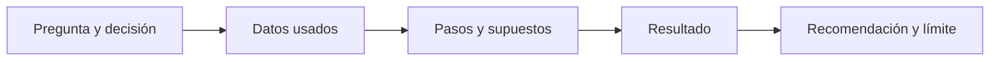

# Cómo estudiar y trabajar de forma reproducible

## Objetivos y prerrequisitos

Sabrás organizar una sesión de estudio desde el móvil o un ordenador, usar ayuda de AI sin delegar el razonamiento y dejar rastro de tus decisiones. No hace falta instalar nada.

## Teoría, práctica y recuperación

Leer una explicación da familiaridad, pero no garantiza que puedas aplicarla. Alterna tres acciones: comprender un ejemplo, resolver uno parecido sin mirar y explicar con tus palabras por qué la respuesta tiene sentido. Ese último paso descubre lagunas antes de que se conviertan en hábitos.

Una sesión mínima desde el móvil puede consistir en leer una lección, responder dos preguntas de comprobación en notas y revisar la solución solo después. Cuando tengas navegador con teclado, abre el notebook de práctica en Google Colab: un **notebook** es una página que mezcla texto, código ejecutable y resultados; lo estudiarás desde cero en Python.

## Reproducibilidad: poder revisar el camino

Un análisis es **reproducible** si otra persona puede entender qué datos se usaron, qué reglas se aplicaron y cómo se llegó a una conclusión. No requiere una herramienta sofisticada al principio: basta con anotar la pregunta, la fecha, los supuestos y los cambios.

El siguiente flujo responde a “¿qué debe conservarse para que una conclusión sea revisable?”

Si falta un eslabón, alguien puede ver un número final pero no comprobar si era apropiado. Más adelante Git, tickets de Jira y documentación permitirán hacer este proceso colaborativo.

## Usar AI como tutor, no como piloto automático

Una buena petición a una AI incluye contexto: “No sé qué es una lista en Python; explícame este error con un ejemplo de gastos y pregúntame después”. Pide que explique cada línea y cambia un valor para comprobar que entiendes el efecto. Nunca des por correcta una consulta, gráfico o conclusión solo porque suena convincente: ejecútala, verifica los supuestos y conserva la fuente.

## Diagnóstico inicial y ruta adaptable

Si ya manejas porcentajes, medias o álgebra, puedes leer el bloque de matemáticas como repaso y dedicar más atención a sus aplicaciones analíticas. No conviene saltarse la definición de métricas, incertidumbre o sesgo: conocer la fórmula no garantiza interpretar bien un dato empresarial.

## Resumen y siguiente paso

- Estudiar implica recuperar y aplicar, no solo leer.
- Reproducibilidad conserva pregunta, datos, pasos, resultado y límites.
- AI acelera la práctica si puedes explicar y verificar su respuesta.

Completa el [diagnóstico inicial](../../../evaluaciones/diagnosticos/diagnostico-inicial.md). Después continúa con el [bloque 01](../../01-fundamentos-datos/README.md): allí se explicará primero qué es un archivo, una tabla y una observación.
