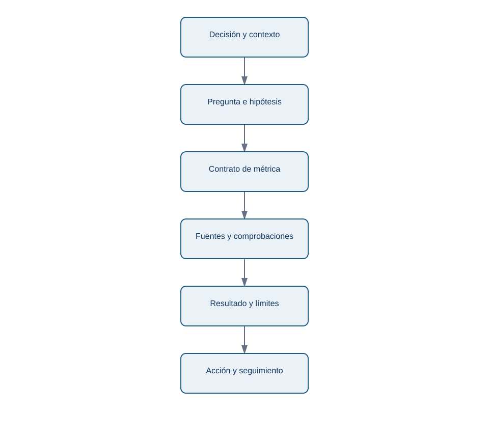
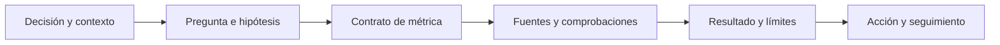

# Método de estudio, brief y trabajo reproducible

## Resultado observable y prerrequisitos

Sabrás estudiar una lección desde el móvil y dejar un brief que otra persona pueda continuar. No hace falta instalar nada. Un **brief** es una nota breve que fija el problema, la decisión, las reglas de medida y los límites antes de investigar; no es un informe final ni una orden de confirmar una sospecha.

## Estudiar para poder aplicar, no solo reconocer

Leer «activación = 29%» puede hacer que el concepto parezca familiar. Poder usarlo exige recuperar la idea sin mirar y defender una decisión. Para cada lección, alterna:

1. **Comprender:** lee el ejemplo y señala palabras nuevas.
2. **Recuperar:** cierra la página y explica con tus palabras qué se mide y por qué.
3. **Aplicar:** resuelve una variación pequeña sin consultar la solución.
4. **Contrastar:** compara con la solución, corrige el razonamiento y anota qué supuesto omitiste.

Desde el móvil puedes copiar la plantilla en una aplicación de notas y escribir en frases cortas. No necesitas escribir código todavía. Cuando tengas ordenador, un **notebook** será una página que mezcla explicación, código ejecutable y resultados; empezarás desde cero en el bloque de Python.

## El brief mínimo que hace el análisis continuable

Una investigación no es reproducible porque use una herramienta moderna. Es **reproducible** cuando otra persona puede entender qué se preguntó, qué información se usó, qué reglas se aplicaron y por qué se recomendó actuar. El siguiente mapa responde a «¿qué debe conservarse para revisar el caso de Lumen?».

<!-- mobile-diagram: rendered fallback -->

Ver código Mermaid editable

Si alguien recibe solo un gráfico final, no puede comprobar si se incluyeron cuentas de prueba, si la comparación tenía la misma ventana o si la recomendación fue prudente. La [plantilla reutilizable](../plantillas/brief-analitico.md) guarda los seis eslabones.

## Ejemplo: un brief inicial para Lumen

Un inicio honesto podría decir:

> **Decisión:** Producto decidirá el viernes si revierte temporalmente el onboarding 4.2 en Android. **Pregunta:** comparar activación a siete días de instalaciones 4.2 frente a 4.1, por sistema operativo y paso del flujo. **Hipótesis alternativas:** error en selector de fecha, cambio de mezcla de campañas o evento de reserva no registrado. **Límite inicial:** una comparación antes/después no demuestra causalidad. **Seguimiento:** si se revierte, medir activación, cancelación y contactos a soporte durante una semana comparable.

Fíjate en lo que no hace: no afirma que el selector «es la causa» y no borra explicaciones alternativas. Un brief puede empezar con incógnitas; su trabajo es hacerlas visibles.

## Usar AI como tutor, no como piloto automático

La AI puede adaptar ejemplos y hacer preguntas, pero no convierte una respuesta convincente en evidencia. Una petición útil para Leo sería: «No sé qué es un denominador. Explícame la activación de Lumen usando tres personas ficticias; después pídeme que defina a quién excluiría». Después verifica el ejemplo cambiando valores y explica por qué cambia el resultado.

No pegues datos personales, credenciales ni información privada de una empresa en una herramienta pública. Cuando más adelante uses código, conserva la fuente y los pasos; cuando uses AI, conserva también la pregunta importante y verifica cualquier consulta o conclusión antes de compartirla.

## Diagnóstico y siguiente ruta

Tener formación matemática ayuda, pero no permite saltarse las decisiones de medida. Una tasa puede estar bien calculada y responder una pregunta equivocada. Si ya dominas porcentajes, usa los ejemplos para repasar y dedica tiempo a los conceptos nuevos: población, evento, grano, ventana y evidencia.

Después de completar el ejercicio, continúa con el [bloque 01](../../01-fundamentos-datos/README.md). Allí aprenderás qué es un archivo, una tabla, una fila y una columna: las piezas que después permitirán implementar el contrato de métrica con datos reales.

## Resumen y comprobación

- Estudiar implica recuperar, aplicar y corregir, no solo leer.
- Un brief conserva decisión, pregunta, contrato, evidencia, límites y seguimiento.
- AI es útil para practicar si mantienes el control de los datos y verificas las conclusiones.

Pregúntate: ¿qué tendría que escribir Lumen en el brief si el sistema deja de registrar `reserva_completada`? ¿Por qué un número calculado correctamente podría seguir siendo una mala base para decidir?
