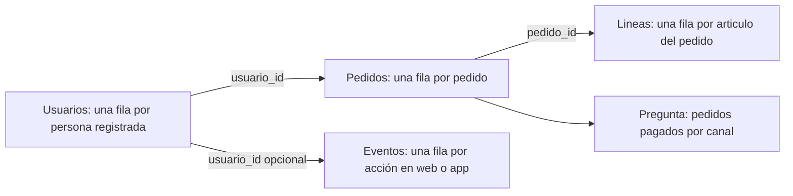

# Bloque 01 — Fundamentos de datos

## Propósito

Antes de programar, Leo necesita aprender a mirar un conjunto de datos como una representación limitada de una operación real. Usaremos durante todo el bloque el caso de **Mercado Faro**, un marketplace con una web y una app: usuarios crean cuentas, hacen pedidos compuestos por líneas de producto y generan eventos de uso.

## Resultado de salida

Al acabar podrás explicar qué representa cada archivo y cada fila; elegir el grano adecuado; relacionar usuarios, pedidos, líneas y eventos sin multiplicar resultados; leer CSV y JSON con precaución; y documentar controles de calidad, privacidad y trazabilidad antes de recomendar una decisión.

## Prerrequisitos

Ninguno. Los términos archivo, tabla, CSV, JSON, clave y relación se construyen desde cero.

## Caso continuo

La dirección pregunta: «¿cuántos pedidos pagados tuvimos ayer y qué canal conviene mejorar?». Esta pregunta parece simple, pero obliga a distinguir personas de pedidos, pedidos de líneas de producto y acciones dentro de una app. Cada lección añade una pieza al mismo mapa.

El diagrama no dice que todas las tablas puedan sumarse entre sí: muestra qué identificador permite conectar cada hecho sin cambiar su significado.

## Lecciones

1. [Archivo, tabla, observación y grano](lecciones/01-archivo-tabla-y-grano.md).
2. [Entidades, eventos, claves, relaciones y joins](lecciones/02-filas-columnas-y-relaciones.md).
3. [CSV, JSON y conversión a tablas analizables](lecciones/03-formatos-y-almacenamiento.md).
4. [Contrato, calidad, privacidad y trazabilidad](lecciones/04-calidad-y-uso-responsable.md).

## Práctica y laboratorio

- Resuelve [la auditoría del marketplace](../../ejercicios/temario-01/comprension/auditoria-marketplace.md) y consulta después [la solución razonada](../../soluciones/temario-01/auditoria-marketplace.md).
- Ejecuta [`notebooks/practicas/01-fundamentos-marketplace.py`](../../notebooks/practicas/01-fundamentos-marketplace.py). No requiere instalar librerías: lee los archivos de ejemplo, verifica reglas y demuestra cómo un join mal planteado cambia una cifra.
- Los archivos mínimos del caso están en [`datasets/temario-01/`](../../datasets/temario-01/).

## Criterio de dominio

No sigas al bloque de Python hasta poder completar, para cada tabla: «cada fila representa…», «su identificador es…», «esta métrica se calcula contando/sumando…» y «estos datos no permiten concluir…».
