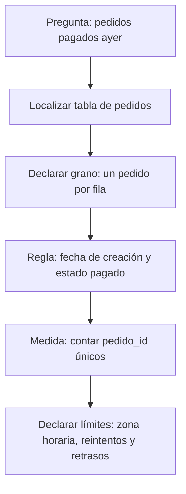

# 01.1 Archivo, tabla, observación y grano

## Objetivos y prerrequisitos

Al terminar podrás distinguir archivo, tabla, fila, columna y celda; escribir el **grano** de una fuente; y explicar por qué contar filas no siempre equivale a contar personas. No se presupone vocabulario técnico.

## Una pregunta cotidiana antes de la jerga

Mercado Faro quiere saber cuántos pedidos pagados recibió ayer. El sistema no guarda «la respuesta»; guarda huellas de cosas que ocurrieron: una persona se registró, pulsó un botón, creó un pedido o añadió dos artículos. Un **dato** es una representación registrada de una parte de la realidad, no la realidad completa.

Un **archivo** es una unidad con nombre y contenido que se puede guardar, copiar y abrir, como una foto o una nota. Si el contenido sigue filas y columnas, puede representar una **tabla**. Una tabla organiza observaciones comparables: una **fila** contiene un caso; una **columna** describe la misma propiedad para todos los casos; una **celda** es el cruce de ambas.

| pedido_id | usuario_id | creado_en | estado | total_eur |
| --- | --- | --- | --- | ---: |
| P-100 | U-10 | 2026-07-24 09:14 | pagado | 42.00 |
| P-101 | U-10 | 2026-07-24 18:05 | cancelado | 18.00 |
| P-102 | U-24 | 2026-07-24 20:22 | pagado | 65.00 |

Aquí cada fila es una observación de **un pedido**, no de un usuario. U-10 aparece dos veces porque hizo dos pedidos. El nombre técnico de esta precisión es el **grano**: la unidad que representa exactamente una fila.

## El grano determina qué cálculo responde a qué pregunta

Antes de abrir una herramienta completa esta frase: «cada fila de esta tabla representa ___». Si la respuesta es «un pedido», contar tres filas responde «tres pedidos»; no «tres clientes». Para clientes únicos se cuentan valores distintos de `usuario_id`; para facturación pagada se suman `total_eur` solo donde `estado = pagado`.

¿Qué camino convierte la pregunta en una cifra defendible?

La cifra no es solo un `COUNT`: depende de la definición de «ayer», del estado que cuenta como pago y de que `pedido_id` no esté duplicado.

## Cuatro granos que no se pueden intercambiar

| Fuente | Cada fila representa | Pregunta adecuada | Error si se trata como pedido |
| --- | --- | --- | --- |
| `usuarios` | una cuenta registrada | ¿Cuántas cuentas nuevas? | ignora compras y sesiones |
| `pedidos` | un pedido iniciado | ¿Cuántos pedidos pagados? | puede incluir varios artículos |
| `lineas_pedido` | un artículo dentro de un pedido | ¿Qué unidades se vendieron? | cuenta artículos como pedidos |
| `eventos` | una acción con hora | ¿Dónde abandona la app? | un usuario puede generar cientos |

Una **entidad** es algo relativamente estable que queremos identificar, como usuario o producto. Un **evento** es algo que ocurre en un momento, como `checkout_iniciado`. Un pedido es una **transacción**: registra un intercambio u operación de negocio. En la siguiente lección se afina esta distinción.

## Ejemplo trabajado: un total que parece correcto y no lo es

El pedido P-100 tiene dos líneas: camiseta (20 €) y envío (2 €); P-102 tiene tres líneas por 65 €. Si unimos pedidos con líneas y después contamos filas, veremos cinco filas y podríamos decir «cinco pedidos». Es falso: hay dos pedidos. La suma de `pedidos.total_eur` tras ese join también se repetirá una vez por línea, inflando los ingresos.

El problema no es el software: es haber olvidado el grano al cambiar de tabla. Conserva siempre una nota junto al análisis: fuente, grano, filtro, periodo y unidad.

## Límites y error frecuente

No asumas que una tabla contiene todo. Los eventos pueden faltar si una persona usa bloqueador; un pedido puede estar pendiente de pago; la hora puede venir en UTC mientras la dirección habla de Madrid. Una tabla es evidencia parcial y debe leerse junto con su cobertura y reglas.

## Resumen y comprobación

- Archivo: contenido guardado con un nombre y un formato.
- Tabla: organización en filas y columnas.
- Grano: lo que representa una fila; dicta qué se puede contar o sumar.

1. Escribe el grano de una tabla de sesiones y otro de una tabla de usuarios.
2. ¿Por qué tres filas con el mismo `usuario_id` no son necesariamente un error?
3. Para «productos vendidos», ¿usarías pedidos o líneas de pedido? Justifica la elección.

Aplica estas ideas en [la práctica del marketplace](../../../ejercicios/temario-01/comprension/auditoria-marketplace.md).
