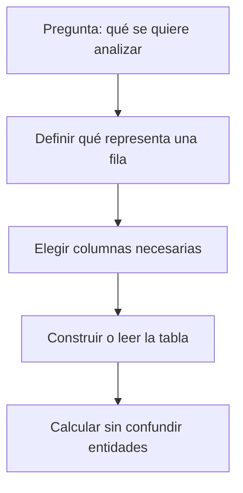

# 01.1 Qué es un dato, un archivo y una tabla

## Objetivos

Entender qué es un dato antes de hablar de herramientas; distinguir una información suelta de un conjunto organizado; y reconocer qué representa una fila de una tabla.

## Empieza por una situación cotidiana

Imagina una tienda que quiere saber qué productos se venden más. Cada vez que una persona compra algo, la tienda puede guardar información: fecha, producto, importe y forma de pago. Cada una de esas piezas es un **dato**: una representación de algo que ocurrió en el mundo real.

La información se guarda en un **archivo**, igual que una fotografía o una nota de texto. Un archivo tiene nombre, contenido y un formato que indica cómo se organiza. No hay magia: un archivo de datos es una manera de guardar información para poder leerla, compartirla o analizarla después.

Una de las formas más comunes de organizar datos es una **tabla**. Una tabla se parece a una hoja de cálculo: tiene columnas que describen qué tipo de información guardamos y filas que recogen casos concretos.

```text
fecha       | producto | importe | canal
2026-01-03  | teclado  | 45.99   | web
2026-01-04  | ratón    | 19.90   | tienda
2026-01-04  | teclado  | 45.99   | web
```

En este ejemplo, la primera fila de datos representa una compra concreta. La columna `producto` responde qué se compró; `importe`, cuánto costó. La tabla no “sabe” qué significa un teclado: nosotros le damos significado a las columnas.

## El grano: la pregunta que evita errores grandes

El **grano** indica qué representa exactamente una fila. Aquí, una fila representa una compra, no un cliente ni un producto. Esta frase parece pequeña, pero evita errores muy caros: si se cuenta una fila como si fuera una persona, un cliente que compra tres veces se contará como tres clientes.



Antes de cualquier análisis, completa siempre esta frase: “cada fila de este conjunto representa…”. Si no puedes completarla, no empieces a sumar ni a calcular promedios.

## Ejemplo IT

Una aplicación registra eventos. Una tabla puede tener una fila por clic, otra por sesión y otra por usuario. Son tablas distintas con granos distintos. Contar clics no responde cuántos usuarios usaron la aplicación; contar sesiones tampoco responde directamente cuántas personas pagaron.

## Error frecuente

Pensar que una tabla es “la realidad”. Una tabla es un modelo parcial. Puede no incluir compras hechas por teléfono, usuarios anónimos o devoluciones. Siempre pregunta qué no está en los datos.

## Comprobación

Para una academia online, escribe el grano de tres tablas posibles: una de alumnos, una de inscripciones y una de visualizaciones de vídeo. ¿Por qué no deben mezclarse sin una relación explícita?
