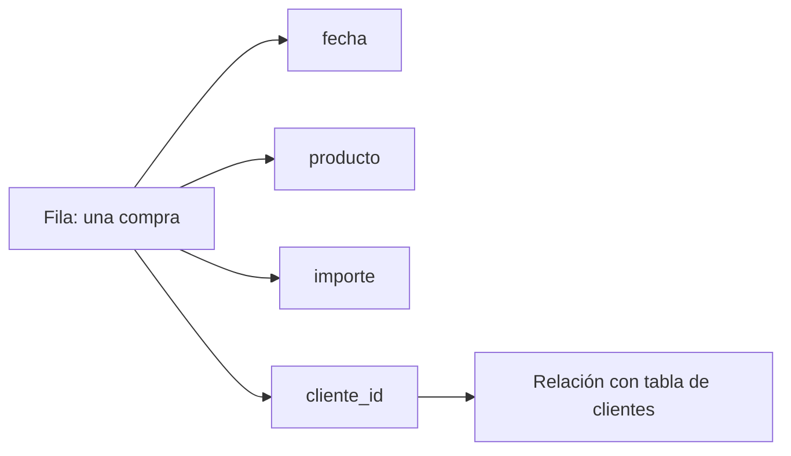
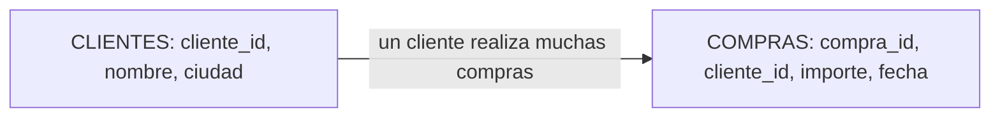

# 01.2 Filas, columnas, tipos y relaciones

## Objetivos

Aprender a leer una tabla con precisión: distinguir filas y columnas, reconocer tipos básicos de datos y entender por qué una clave permite relacionar tablas sin duplicar significado.

## Filas y columnas no son solo una forma visual

Una **fila** contiene información de un caso. Una **columna** guarda el mismo tipo de atributo para muchos casos. En una tabla de compras, `importe` debería contener números; en una tabla de usuarios, `fecha_registro` debería contener fechas. El tipo de información determina qué operaciones tienen sentido.

No tiene sentido calcular la media de `ciudad`; sí puede tener sentido contar cuántos usuarios hay por ciudad. No tiene sentido ordenar alfabéticamente un importe para encontrar la venta mayor; sí tiene sentido convertirlo a número y compararlo.

## Tipos que encontrarás al empezar

- **Texto:** nombre de producto, ciudad, comentario.
- **Número:** importe, cantidad, edad, latencia.
- **Fecha y hora:** momento de registro, compra o despliegue.
- **Booleano:** verdadero/falso; por ejemplo, `es_cliente`.
- **Categoría:** conjunto limitado de etiquetas, como plan `gratis`, `pro` o `empresa`.

Un número puede representar cosas distintas: un identificador `cliente_id=1042` parece número, pero no debes calcular su media. Es una etiqueta técnica, no una cantidad.

## Claves y relaciones

Una **clave** es una columna que permite identificar o conectar información. Si `cliente_id` identifica de forma única a cada cliente, se llama clave primaria de la tabla de clientes. La misma columna puede aparecer en la tabla de compras para indicar quién realizó cada compra; allí actúa como clave foránea o referencia.

La relación dice: un cliente puede realizar muchas compras; una compra pertenece a un cliente. Esta información es esencial al combinar tablas. Si una tabla de clientes tiene accidentalmente dos filas para el mismo `cliente_id`, una unión puede duplicar importes sin que el error sea evidente.

## Error frecuente

Confundir un identificador con una medida. `pedido_id` y `cliente_id` sirven para identificar; no para hacer promedios. También es un error asumir que una columna “única” realmente lo es sin comprobar duplicados y nulos.

## Comprobación

Diseña las columnas mínimas de una tabla de tickets de soporte. ¿Qué representa cada fila? ¿Qué columna conectaría un ticket con un cliente? ¿Cuál parece numérica pero no debe tratarse como medida?
