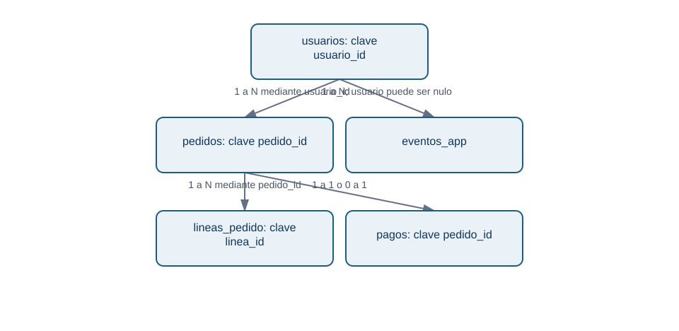
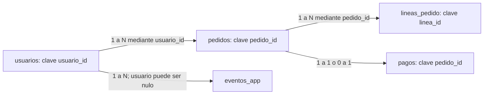

# 01.2 Entidades, eventos, claves, relaciones y joins

## Objetivos y prerrequisitos

Aprenderás a diseñar y leer relaciones entre tablas, distinguir clave primaria y foránea, comprobar cardinalidades 1:1, 1:N y N:M, y detectar un join que multiplica filas. Parte de la lección 01: ya sabes que cada tabla tiene grano.

## Del mundo real a varias tablas pequeñas

Guardar nombre, dirección y producto repetidos en cada pedido vuelve los datos difíciles de corregir y de analizar. Separamos la información según lo que representa: `usuarios` para personas registradas, `pedidos` para transacciones y `lineas_pedido` para artículos del pedido. Una **dimensión** suele describir una entidad (por ejemplo, producto o usuario); una tabla de hechos registra eventos o transacciones medibles.

También existe un **snapshot**: una fotografía de estado en un instante. Una tabla con una fila por producto y día que guarda su stock al cierre no es un evento de cambio de stock: es el estado observado a esa fecha. Confundir ambos altera tendencias y acumulados.

## Claves: etiquetas para reconocer y conectar

Una **clave primaria** identifica de manera única una fila dentro de su tabla: `usuarios.usuario_id` o `pedidos.pedido_id`. Una **clave foránea** guarda la referencia a otra tabla: `pedidos.usuario_id` apunta al usuario que hizo el pedido. Que sea numérica o de texto no la convierte en medida: no tiene sentido promediar identificadores.

¿Cómo se conectan las piezas del caso sin inventar relaciones?

<!-- mobile-diagram: rendered fallback -->

Ver código Mermaid editable

Un usuario puede tener muchos pedidos (1:N); cada pedido pertenece a un usuario si el negocio lo exige. Un pago puede ser 0:1 con pedido si hay pedidos iniciados pero no cobrados. Las relaciones describen una regla de negocio, no una forma de dibujo.

## Cardinalidad y tabla puente

- **1:1:** una fila A se asocia como máximo a una fila B; por ejemplo, pedido y comprobante de pago final si el sistema lo garantiza.
- **1:N:** un usuario puede tener N pedidos; cada pedido tiene un usuario.
- **N:M:** un pedido puede incluir N productos y un producto aparece en M pedidos. No se conecta directamente: `lineas_pedido` actúa como **tabla puente** con `pedido_id`, `producto_id`, cantidad y precio.

| pedido_id | producto_id | cantidad | precio_unitario_eur |
| --- | --- | ---: | ---: |
| P-100 | PR-7 | 1 | 20.00 |
| P-100 | PR-9 | 1 | 20.00 |
| P-102 | PR-7 | 2 | 32.50 |

La tabla puente no es una molestia técnica: conserva el grano «un artículo de un pedido» y permite responder unidades por producto sin repetir atributos del pedido.

## Join: combinar solo con una hipótesis verificable

Un **join** combina filas según una clave. Antes de ejecutarlo escribe: (1) grano de la tabla izquierda, (2) grano de la derecha, (3) cardinalidad esperada, (4) qué métrica se mantendrá. Si `pedidos` (uno por pedido) se une a `lineas_pedido` (varias por pedido), el resultado tendrá grano de línea, no de pedido.

Ejemplo: P-100 total 42 € y dos líneas. Tras el join aparecerá dos veces con 42 €. Sumar `total_eur` da 84 € para ese pedido: una multiplicación silenciosa. Para facturación, agrega las líneas por pedido primero o calcula la métrica en `pedidos` antes de unir dimensiones.

Un caso especialmente peligroso es unir dos tablas que tienen varias filas por `usuario_id` (eventos y pedidos). Si U-10 tiene 3 eventos y 2 pedidos, el join produce 6 filas. Esa tabla no representa ni eventos ni pedidos originales.

## Diccionario y contrato de datos

El **diccionario de datos** define el significado de cada columna. Un **contrato de datos** además expresa reglas compartidas entre quien produce y quien consume la fuente: esquema, grano, claves, actualización, valores válidos y responsable.

| Campo | Definición | Regla | Propietario |
| --- | --- | --- | --- |
| `pedido_id` | identificador estable de pedido | único, no nulo | Checkout |
| `creado_en_utc` | instante de creación en UTC | ISO 8601, no nulo | Plataforma |
| `total_eur` | importe cobrado, IVA incluido | >= 0; devolución separada | Pagos |
| `canal` | origen atribuido al pedido | `web`, `app`, `partner` | Growth |

Un contrato evita que «total» cambie de incluir a excluir IVA sin aviso. También permite investigar una incidencia: versión de fuente, momento de carga y responsable dejan **trazabilidad**.

## Error frecuente, resumen y comprobación

No des por única una clave por el nombre ni des por válida una relación por tener la misma columna. Comprueba nulos, duplicados y número de filas antes y después de cada join.

1. ¿Cuál es el grano del resultado de unir `pedidos` con `lineas_pedido`?
2. Da un ejemplo realista de relación N:M distinta de productos y pedidos.
3. ¿Qué regla del contrato impediría contar dos veces el mismo pedido?

Resuelve las preguntas de joins en [la práctica](../../../ejercicios/temario-01/comprension/auditoria-marketplace.md).
