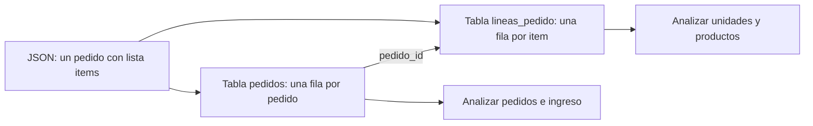

# 01.3 CSV, JSON y conversión a tablas analizables

## Objetivos y prerrequisitos

Sabrás leer un CSV y un JSON como archivos de texto, explicar sus diferencias operativas, reconocer separador, codificación y fechas, y convertir un JSON de pedidos en tablas con grano claro. Se parte de archivo y tabla, no de experiencia con programación.

## CSV: una tabla escrita línea a línea

Un **CSV** (*comma-separated values*) guarda una tabla como texto. La primera línea suele ser el encabezado; cada línea posterior, una fila. El nombre es histórico: en España es frecuente usar punto y coma para no confundir la coma decimal con el separador.

```text
pedido_id;creado_en_utc;total_eur;canal
P-100;2026-07-24T07:14:00Z;42,00;web
P-102;2026-07-24T18:22:00Z;65,00;app
```

Antes de tratarlo como tabla hay que acordar el **dialecto**: separador `;`, decimal `,`, codificación de caracteres (preferiblemente UTF-8), comillas para texto con separadores y formato de fecha. Si una herramienta espera coma como separador, puede leer toda la línea como una sola columna; si interpreta `42,00` en otro contexto, puede dejarlo como texto.

La fecha `2026-07-24T07:14:00Z` sigue ISO 8601: `Z` significa UTC. No la cambies a «hora local» sin declarar zona y regla de conversión.

## JSON: una ficha con estructura interna

Un archivo **JSON** (*JavaScript Object Notation*) también es texto, pero puede contener objetos y listas. Es habitual al recibir datos de una API: un servicio responde con una ficha de pedido que incluye al usuario y sus artículos.

```json
{
  "pedido_id": "P-100",
  "usuario": {"usuario_id": "U-10", "pais": "ES"},
  "items": [
    {"producto_id": "PR-7", "cantidad": 1, "precio_eur": 20.0},
    {"producto_id": "PR-9", "cantidad": 1, "precio_eur": 20.0}
  ],
  "total_eur": 42.0
}
```

No hay una única conversión correcta de JSON a CSV. El objeto principal se puede convertir en una fila de `pedidos`; `usuario.usuario_id` se extrae como una columna; cada elemento de `items` debe crear una fila de `lineas_pedido`. Repetir el pedido en cada línea es válido solo si declaramos que el resultado tiene grano de línea y no reutilizamos `total_eur` como si fuera un importe por línea.



El objetivo de la conversión no es «aplanar todo»: es conservar significado y poder analizar cada pregunta con el grano correspondiente.

## Otros medios y elección razonada

Excel es una aplicación y un formato útil para revisión humana y casos pequeños, pero varias ediciones manuales sin historial dificultan reproducir un análisis. Parquet guarda datos por columnas y tipos de forma eficiente; suele usarse con herramientas de datos, no editándose a mano. Una base de datos mantiene datos compartidos con consultas, permisos y reglas; SQL, MongoDB o DynamoDB se verán más adelante con profundidad.

La elección responde a una necesidad: CSV para intercambio de tabla simple; JSON para respuestas estructuradas; Parquet para volúmenes tabulares y procesos analíticos; base de datos para operación concurrente. Ningún formato arregla un grano o una definición defectuosos.

## Contraejemplos y comprobación

No abras un CSV «a doble clic» y des por hecho que se interpretó bien. Verifica columnas, filas, tipos, caracteres como `ñ` y fechas. No conviertas una lista JSON en una sola celda para luego intentar contar productos.

1. ¿Qué separador y decimal usa el CSV del ejemplo?
2. ¿Qué dos tablas crearías a partir del JSON y cuál sería su clave de unión?
3. ¿Por qué `total_eur` no se debe sumar sin cuidado tras expandir `items`?

El laboratorio ejecutable muestra una conversión deliberadamente pequeña y auditable.
