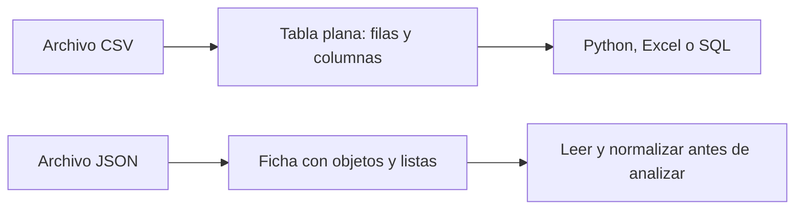

# 01.3 CSV, JSON, Excel, Parquet y bases de datos

## Objetivos

Saber qué problema resuelve cada formato básico y elegir una forma razonable de guardar o recibir información sin memorizar una lista de siglas.

## CSV: una tabla escrita como texto

Un archivo **CSV** significa *Comma-Separated Values*: valores separados por comas. Es un archivo de texto que representa una tabla. La primera línea suele contener los nombres de las columnas; cada línea posterior es una fila.

```text
fecha,producto,importe
2026-01-03,teclado,45.99
2026-01-04,ratón,19.90
```

CSV es sencillo de abrir, compartir y leer con Python, Excel o un editor de texto. Su simplicidad también tiene límites: no guarda bien tipos complejos, fórmulas, varias hojas ni una estructura dentro de otra. Además, hay que acordar separador, codificación, formato de fecha y separador decimal.

## JSON: una ficha que puede contener otras fichas

**JSON** significa *JavaScript Object Notation*. Es texto estructurado mediante pares `campo: valor`. A diferencia de un CSV, puede guardar objetos dentro de objetos y listas. Es frecuente en APIs, configuraciones y eventos de aplicaciones.

```json
{
  "pedido_id": 1001,
  "cliente": {
    "nombre": "Leo",
    "ciudad": "Madrid"
  },
  "productos": ["teclado", "ratón"],
  "importe": 65.89
}
```

El JSON anterior es una ficha de pedido. No es una tabla, aunque se pueda transformar en una. Para analizar muchos pedidos, normalmente tendrás que decidir qué campos extraer y cómo convertir listas u objetos anidados en columnas o tablas relacionadas.



## Excel, Parquet y bases de datos

**Excel** es una aplicación y un formato de libro de trabajo; es útil para revisión manual, cálculos ligeros y comunicación. No es ideal como fuente única de procesos repetibles si múltiples personas lo editan sin control.

**Parquet** es un formato optimizado para datos tabulares grandes. Guarda columnas de forma eficiente y conserva tipos mejor que CSV. Normalmente lo usarás mediante Python, Spark, DuckDB o un warehouse, no editándolo a mano.

Una **base de datos** organiza información para que aplicaciones y personas puedan consultarla con reglas de acceso, relaciones y actualizaciones. SQL es un lenguaje para consultar muchas bases relacionales; MongoDB almacena documentos similares a JSON; DynamoDB se diseña alrededor de claves y patrones de acceso.

## Cómo elegir sin obsesionarte

Empieza preguntando: ¿necesito una tabla simple que cualquiera pueda abrir? CSV. ¿Recibo una respuesta con estructuras anidadas de una API? JSON. ¿Trabajo con muchos datos tabulares repetidamente? Parquet o una base de datos. ¿Necesito revisar manualmente algo pequeño? Excel puede ser adecuado.

La elección no elimina el deber de conocer grano, calidad y significado.

## Comprobación

Explica a otra persona la diferencia entre CSV y JSON sin usar las palabras “plano” ni “anidado”. Después indica cuál esperarías recibir de una API meteorológica y por qué.
