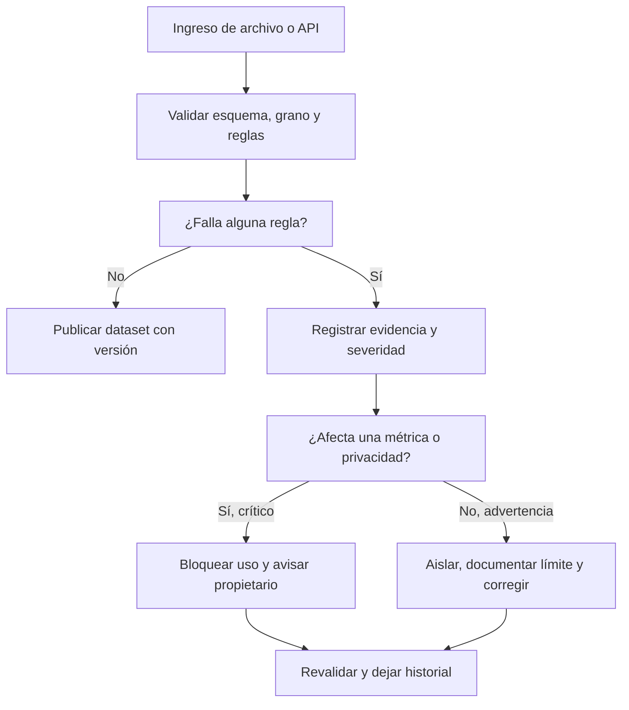

# 01.4 Contrato, calidad, privacidad y trazabilidad

## Objetivos y prerrequisitos

Aprenderás a convertir «revisar datos» en reglas observables, clasificar incidencias por severidad, investigar ausencias sin borrarlas por costumbre y limitar el uso de información personal. Requiere comprender grano, claves y formatos de las lecciones anteriores.

## Calidad no significa perfección

Un conjunto es de calidad suficiente si sirve para una decisión concreta con límites conocidos. Los pedidos de Mercado Faro pueden ser aptos para planificar empaquetado diario y no para estudiar satisfacción, porque no contienen opiniones. Antes de calcular una métrica, documenta qué debe ser cierto.

| Dimensión | Pregunta operativa | Regla de ejemplo |
| --- | --- | --- |
| Completitud | ¿faltan campos necesarios? | `pedido_id`, fecha y estado no nulos |
| Validez | ¿respetan formato y rango? | importe >= 0; fecha ISO 8601 |
| Consistencia | ¿la misma idea se codifica igual? | canal solo `web`, `app`, `partner` |
| Unicidad | ¿se repite indebidamente el hecho? | `pedido_id` único en pedidos |
| Actualidad | ¿llega a tiempo? | carga antes de 09:00 del día siguiente |

La calidad necesita responsable y reacción, no solo una lista. Una regla fallida se registra con fecha, fuente, número de filas afectadas, severidad, decisión y seguimiento: eso es **trazabilidad**.

## De regla a decisión: severidad y contrato

El contrato de datos de la lección 02 declara esquema, grano, reglas, propietario y frecuencia. Ahora añadimos severidad. Un `pedido_id` duplicado que infla ingresos es **crítico**: se bloquea el reporte. Un canal nuevo `affiliate` puede ser una advertencia: se aísla, se consulta a Growth y no se adivina a qué categoría pertenece. Una descripción de producto vacía quizá sea informativa y no impida el cálculo de pedidos.

¿Cómo se gobierna una incidencia sin esconderla bajo una limpieza automática?

El flujo enseña que «limpiar» no equivale a borrar. Primero se preserva evidencia; después se decide una corrección reproducible.

## Ausencias, sesgo y cobertura

Un vacío puede significar «no aplica», «no se capturó», «falló el tracking» o «la persona no quiso responder». Si `pais` falta sobre todo en usuarios de la app antigua, eliminar esas filas altera la población y puede esconder un fallo técnico. Mide ausencia por fecha, versión, canal y segmento; declara quién queda fuera antes de concluir que un canal rinde peor.

El **sesgo de cobertura** aparece cuando la fuente representa peor a parte de la población. Observar que quienes activaron notificaciones compran más no prueba que activar notificaciones cause compras: pueden ser usuarios ya más interesados. Un analista separa observación, explicación posible y decisión que aún requiere evidencia.

## Privacidad: finalidad, minimización y retención

Los datos personales identificables (**PII**, por *personally identifiable information*) son datos que identifican o pueden ayudar a identificar a una persona, como correo, teléfono, dirección o combinaciones poco frecuentes. Para contar pedidos por canal no necesitamos el correo. Aplicamos:

- **Finalidad:** define para qué se usa cada campo antes de recogerlo o consultarlo.
- **Minimización:** usa solo los campos necesarios; sustituye identificadores por un ID interno cuando sea posible.
- **Acceso:** limita quién puede ver PII y no copies datos reales en notebooks, ejercicios o capturas.
- **Retención:** fija cuánto tiempo se conserva y cómo se elimina o anonimiza según la política y normativa aplicables.

Pseudonimizar no vuelve un conjunto automáticamente anónimo: un identificador sustituido aún puede relacionarse con una persona si existe la tabla de correspondencia o combinaciones reidentificables. Para decisiones legales o de tratamiento real, intervienen responsables de privacidad y la normativa vigente; el analista no debe improvisar permisos.

## Resumen y comprobación

Una métrica defendible exige grano, contrato y controles. La ausencia es un resultado que se investiga; calidad y privacidad son condiciones del análisis, no una fase administrativa final.

1. Clasifica como crítica, advertencia o informativa una fecha nula en un pedido pagado y justifica.
2. ¿Por qué borrar todos los nulos de `pais` puede sesgar una comparación por canal?
3. Para un dashboard de pedidos por canal, ¿qué PII puedes excluir?

Completa [la auditoría](../../../ejercicios/temario-01/comprension/auditoria-marketplace.md) y ejecuta el laboratorio antes de pasar a Python.
