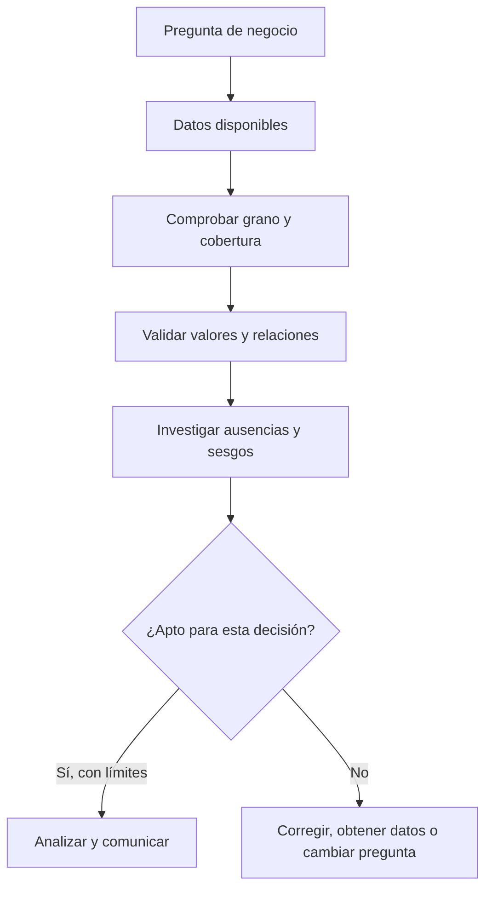

# 01.4 Calidad, ausencia, sesgo, privacidad y uso responsable

## Objetivos

Revisar un conjunto de datos antes de analizarlo, interpretar ausencias sin borrarlas por costumbre y reconocer que una decisión basada en datos también puede causar daño.

## Calidad como condición de confianza

La calidad no significa que un dataset sea perfecto. Significa que conocemos si es adecuado para una decisión concreta. Una tabla de compras puede ser suficiente para estimar ingresos diarios y no serlo para saber satisfacción de clientes.

Cinco controles iniciales son especialmente útiles:

- **Completitud:** ¿faltan valores necesarios para la pregunta?
- **Validez:** ¿los valores respetan reglas, unidades y formatos?
- **Consistencia:** ¿la misma idea está registrada de la misma forma?
- **Unicidad:** ¿existen duplicados indebidos?
- **Actualidad:** ¿el dato llega a tiempo para la decisión?

## Los nulos cuentan una historia

Un valor ausente no es automáticamente un error. Puede significar “no se aplica”, “no se midió”, “falló el sistema” o “la persona prefirió no responder”. Borrar todas las filas con nulos puede eliminar justo a la población con la que tienes un problema.

Por ejemplo, si el campo `ingresos` falta sobre todo en usuarios que abandonan un formulario, la ausencia es información sobre fricción. Antes de imputar o eliminar, mide dónde faltan datos, desde cuándo y en qué segmentos.

## Sesgo, privacidad y propósito

Un dataset puede representar peor a grupos que usan menos una aplicación, tienen conectividad limitada o no están incluidos en la fuente. Un modelo entrenado con esos datos puede amplificar esa desigualdad. El analista debe declarar cobertura, exclusiones y riesgos, no tratarlos como una nota al pie.

La privacidad comienza antes de abrir un archivo: recoge solo los datos necesarios, evita copiar identificadores personales en notebooks, limita acceso y define cuánto tiempo se conservan. Que un sistema permita acceder a una columna no significa que sea legítimo usarla para cualquier objetivo.

## Caso práctico

Una empresa quiere comparar uso por ciudad, pero el 30 % de usuarios no informa ciudad y ese porcentaje es mayor en móvil. Concluir que “móvil usa menos el producto en ciertas ciudades” sin estudiar la ausencia puede ser falso. Primero se investiga el formulario, la geolocalización, el consentimiento y los segmentos afectados.

## Comprobación

Elige una de las cinco dimensiones de calidad y describe: un error concreto, cómo lo detectarías, qué decisión podría dañar y cuál sería una respuesta prudente.
