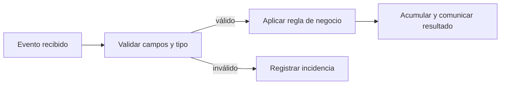

# Bloque 02 - Python desde cero: reglas verificables para eventos y pedidos

## Propósito y resultado de salida

Python es un lenguaje para expresar instrucciones que un ordenador puede repetir. En análisis no se aprende para "programar por programar": se usa para convertir una regla de negocio -por ejemplo, «un pedido confirmado debe tener importe positivo»- en un proceso visible, repetible y comprobable.

Al terminar, Leo podrá leer, escribir y depurar un programa pequeño que reciba eventos o pedidos, valide casos anómalos, calcule resultados y explique qué datos descartó y por qué. Aún no trabajará con miles de filas ni con Pandas: primero dominará las piezas que luego Pandas automatiza.

## Caso continuo: Lumen

Lumen es una app ficticia de comercio. Cada vez que una persona inicia o completa una compra se registra un **evento**: un pequeño diccionario con información como `tipo`, `usuario` e `importe`. Durante el bloque construiremos un auditor sencillo de pedidos: clasifica su estado, suma solo pedidos válidos y deja constancia de los errores. El caso permite ver que sintaxis, calidad de datos y decisión de negocio están unidas.

El mismo esquema aparecerá después en un notebook y, con estructuras más potentes, en Pandas. No se debe «arreglar» silenciosamente un evento: que sea inválido es información útil para producto e ingeniería.

## Prerrequisitos y forma de estudio

Solo se presupone haber visto qué es un dato y una tabla en los bloques 00-01. Puede usarse [Google Colab](https://colab.research.google.com/) desde un navegador: crea un notebook, pega una celda, ejecútala y observa la salida. Un **notebook** mezcla texto, código y resultados; un **script** es un archivo `.py` que se ejecuta completo. Ambos usan Python; se elige notebook para explorar y script para repetir un proceso estable.

En cada lección: copia el ejemplo, predice su salida, ejecútalo, cambia un valor y explica qué regla se ha modificado. No avances si un mensaje de error aún parece misterioso: la lección 05 enseña a convertirlo en una pista.

## Lecciones

1. [Entorno, valores, variables y expresiones](lecciones/01-entorno-valores-y-variables.md)
2. [Colecciones: pedidos, copias y estructura anidada](lecciones/02-colecciones-y-datos-sencillos.md)
3. [Condiciones, operadores lógicos y bucles seguros](lecciones/03-condiciones-y-bucles.md)
4. [Funciones, contratos, módulos y alcance](lecciones/04-funciones-y-alcance.md)
5. [Errores, pruebas y depuración basada en evidencia](lecciones/05-errores-y-depuracion.md)
6. [Laboratorio: auditoría reproducible de pedidos](lecciones/06-estilo-y-practica-gastos.md)

## Práctica verificable

1. Lee el [laboratorio ejecutable de Lumen](../../notebooks/practicas/02-auditoria-pedidos.py). Puedes pegarlo por secciones en Colab o ejecutarlo con `python notebooks/practicas/02-auditoria-pedidos.py`.
2. Resuelve [la auditoría de pedidos](../../ejercicios/temario-02/aplicacion/gastos-personales.md) antes de mirar la [solución razonada](../../soluciones/temario-02/gastos-personales.md).
3. El notebook histórico de gastos queda como práctica adicional, pero el caso de Lumen es la evaluación recomendada porque incluye entradas inválidas, límites y salidas esperadas.

## Criterio de dominio

No basta con que el código «no falle». Debes poder señalar la entrada, la salida, la regla y al menos un caso límite para cada función. Si no sabes qué haría tu programa con `None`, un importe como texto, una lista vacía o un pedido exactamente en el umbral, todavía no está listo para automatizar decisiones.
