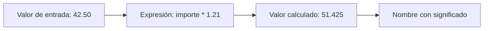

# 01 - Entorno, valores, variables y expresiones

## Resultado observable y prerrequisitos

Al finalizar podrás ejecutar una celda, predecir el resultado de una expresión y guardar cada resultado con un nombre que explique qué representa. No se requiere experiencia programando.

## Del dato a una regla ejecutable

Imagina que Lumen recibe un pedido de 42,50 euros. Antes de hablar de «variables», mira una operación mínima:

```python
42.50 * 1.21
```

Python evalúa esa **expresión** y devuelve `51.425`. Una expresión combina valores y operadores para producir otro valor. Para análisis, conviene dar un significado a cada parte:

```python
importe_sin_iva = 42.50
TIPO_IVA = 0.21
importe_con_iva = importe_sin_iva * (1 + TIPO_IVA)
print(importe_con_iva)
```

Una **variable** es un nombre que referencia un valor; `=` es una asignación, no una igualdad matemática. La constante en mayúsculas comunica una convención humana: no debería cambiar durante el cálculo. Python no impide modificarla, por lo que la revisión sigue siendo necesaria.



El diagrama recuerda que un nombre no convierte un dato en correcto: solo hace visible qué creemos que representa.

## Tipos y operadores

Los tipos básicos son entero (`3`, `int`), decimal (`3.5`, `float`), texto (`"web"`, `str`), booleano (`True` / `False`, `bool`) y ausencia explícita (`None`). `type(valor)` permite inspeccionarlos. Los operadores aritméticos incluyen `+`, `-`, `*`, `/` y `%` (resto); los comparadores `==`, `!=`, `<`, `<=`, `>` y `>=` producen booleanos.

```python
canal = "web"
importe = 42.50
es_web = canal == "web"
es_importe_positivo = importe > 0
print(es_web, es_importe_positivo)  # True True
```

`"42.50" + "10"` da `"42.5010"`: une texto. No conviertas un dato a `float` por reflejo; primero confirma que la fuente define ese texto como número y qué moneda usa.

## Notebook, script y estado de ejecución

En un notebook ejecutas celdas en cualquier orden. Si ejecutas una celda que usa `importe` antes de aquella que lo crea, aparecerá `NameError`. En un script, Python lee las líneas de arriba abajo cada vez. Para aprendizaje, un notebook facilita experimentar; para una auditoría repetible, un script evita depender del orden oculto de clics.

## Micropráctica

1. Predice y ejecuta `7 // 2`, `7 / 2` y `7 % 2`.
2. Crea `importe = "42.50"`. Compara `type(importe)` con `type(42.50)` y explica por qué no deben sumarse directamente.
3. Guarda `importe_original` y `importe_con_descuento` en nombres distintos. ¿Qué valor podrías auditar si sobrescribieras el primero?

## Error frecuente y resumen

Evita nombres como `x` o `dato` cuando `importe_bruto` explica el significado. Tampoco confundas `=` con `==`: el primero guarda; el segundo compara. En la próxima lección varios valores formarán un pedido y una colección de eventos.
