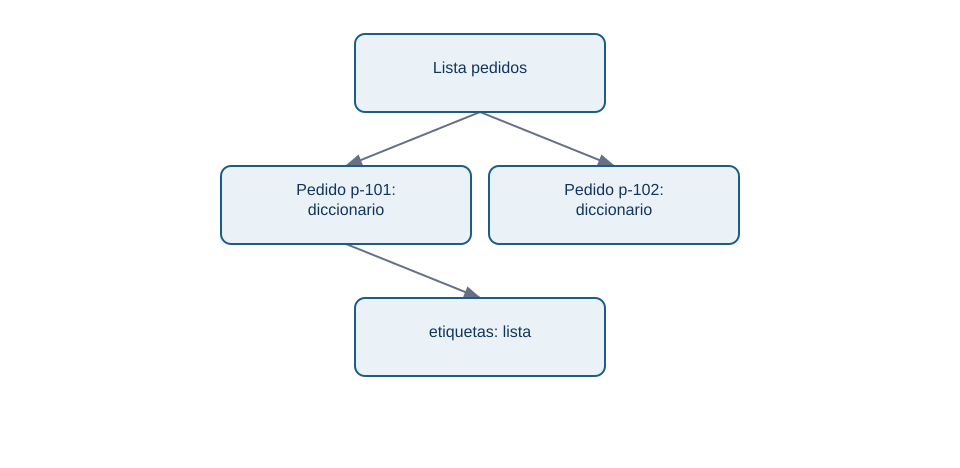
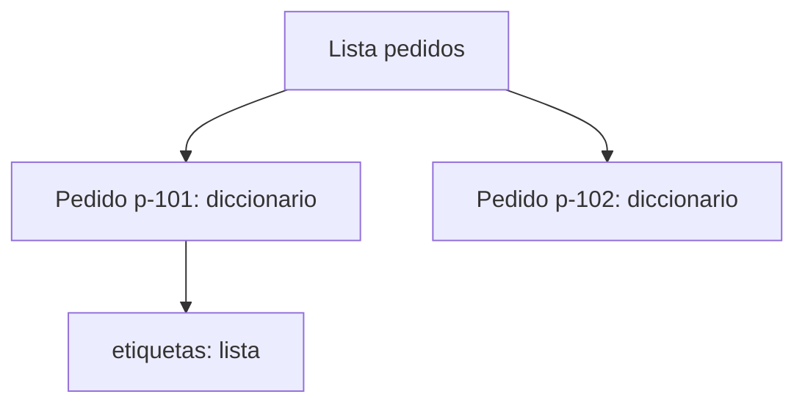

# 02 - Colecciones: pedidos, copias y estructura anidada

## Resultado observable y prerrequisitos

Al finalizar sabrás elegir lista, tupla, conjunto o diccionario para representar eventos de Lumen; accederás sin perder de vista índices, claves, copias y mutabilidad. Requiere valores y tipos de la lección 01.

## Un pedido tiene partes; una colección conserva relaciones

Un diccionario asocia una **clave** con su valor. Una lista conserva una secuencia ordenada. Juntos pueden representar pedidos recibidos:

```python
pedido = {"id": "p-101", "canal": "web", "importe": 42.50, "etiquetas": ["nuevo", "promo"]}
pedidos = [pedido, {"id": "p-102", "canal": "app", "importe": 18.00, "etiquetas": []}]
print(pedidos[0]["importe"])  # 42.5
```

`pedidos[0]` significa «primer elemento» porque Python empieza a contar desde cero. `pedido["importe"]` usa una clave, no una posición. El anidamiento (`lista` dentro de `dict`) se parece a una respuesta JSON de una API; todavía no es una tabla, pero ya obliga a preguntar qué campos son obligatorios.

<!-- mobile-diagram: rendered fallback -->


<details>
<summary>Ver código Mermaid editable</summary>


</details>

La relación no es una secuencia: un pedido tiene varios campos y una lista contiene varios pedidos.

## Cuatro colecciones y su propósito

| Colección | Ejemplo | Mantiene orden | Se puede modificar | Uso razonable |
| --- | --- | --- | --- | --- |
| Lista `[]` | `["web", "app"]` | Sí | Sí | Eventos o resultados en orden. |
| Tupla `()` | `("EUR", 2)` | Sí | No | Configuración que no debe cambiar. |
| Conjunto `set()` | `{ "web", "app" }` | No prometido | Sí | Valores únicos, por ejemplo canales observados. |
| Diccionario `{}` | `{"importe": 42.5}` | Claves accesibles por nombre | Sí | Un registro con campos. |

Un conjunto elimina duplicados: `set(["web", "web", "app"])` contiene dos canales. No lo uses si necesitas conservar cada evento: que dos pedidos compartan canal no los vuelve duplicados.

## Slicing, mutabilidad y copias

El *slicing* toma una parte: `pedidos[0:2]` incluye posiciones 0 y 1; el extremo final no entra. Las listas y diccionarios son **mutables**: se pueden alterar después de crearse. Por eso esta aparente copia es peligrosa:

```python
original = {"id": "p-101", "etiquetas": ["nuevo"]}
alias = original
alias["etiquetas"].append("revisar")
print(original["etiquetas"])  # también cambia
```

`alias` y `original` apuntan al mismo objeto. `original.copy()` copia solo el nivel exterior; para datos anidados usa `copy.deepcopy` cuando de verdad necesites independizar todos los niveles. Antes de copiar masivamente, pregunta si modificar el original es parte de la regla o un error.

```python
from copy import deepcopy
pedido_limpio = deepcopy(original)
pedido_limpio["etiquetas"].append("auditable")
```

## Microprácticas y límites

1. Crea tres pedidos y obtén los dos últimos con slicing.
2. Obtén los canales únicos con un conjunto. ¿Por qué el resultado no prueba cuántos pedidos hubo?
3. Prueba `pedido["descuento"]`: aparecerá `KeyError`. Después usa `pedido.get("descuento")` y explica la diferencia entre «no existe» y un descuento igual a cero.
4. Haz una copia profunda de un pedido con etiquetas, modifica la copia y verifica que el original no cambia.

No uses `get("importe", 0)` sin acordar su significado: sustituir ausencia por cero puede esconder un fallo de instrumentación. En la siguiente lección decidirás qué hacer con cada pedido mediante condiciones y bucles.
