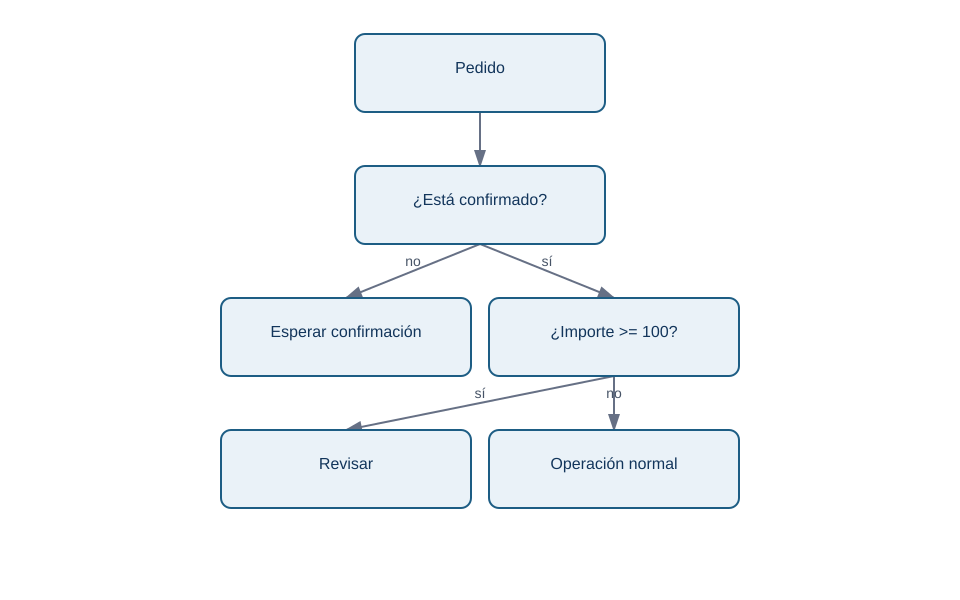
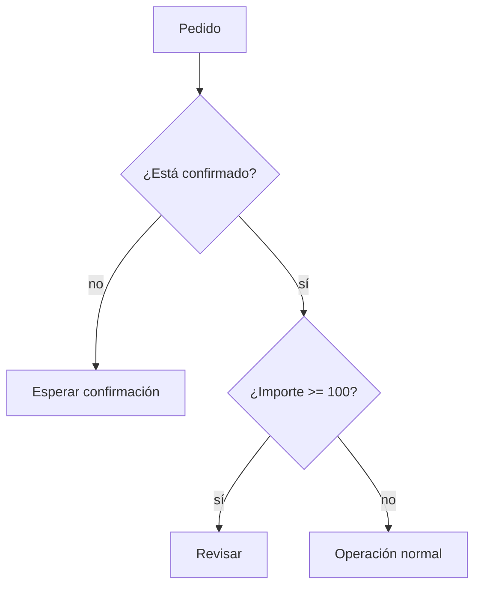

# 03 - Condiciones, operadores lógicos y bucles seguros

## Resultado observable y prerrequisitos

Aplicarás una regla explícita a cada pedido, distinguiendo estados, y repetirás el proceso sin perder eventos. Requiere listas y diccionarios.

## Una regla de negocio tiene bordes

Lumen considera revisable un pedido si su importe es al menos 100 EUR **y** está confirmado. Antes de codificar, decide qué pasa en los límites: 100 entra; 99,99 no; un importe desconocido no se aprueba automáticamente.

```python
importe = 100
estado = "confirmado"

if importe >= 100 and estado == "confirmado":
    accion = "revisar"
elif estado != "confirmado":
    accion = "esperar confirmacion"
else:
    accion = "operacion normal"
```

`if` evalúa una condición, `elif` ofrece una alternativa y `else` cubre el resto. La sangría define qué instrucciones pertenecen a cada rama. Los operadores `and`, `or` y `not` combinan condiciones: `and` exige ambas verdaderas; `or` basta con una; `not` invierte. Usa paréntesis cuando mezcles condiciones para que la prioridad sea legible.

<!-- mobile-diagram: rendered fallback -->


<details>
<summary>Ver código Mermaid editable</summary>


</details>

El orden de las preguntas importa: comparar un importe ausente antes de validar el estado o el tipo puede provocar un error o una decisión falsa.

## Repetir: `for` cuando conoces la colección, `while` cuando esperas una condición

Un `for` visita cada elemento de una lista. Para sumar solo confirmados, se usa un acumulador que empieza en cero:

```python
total_confirmado = 0
for pedido in pedidos:
    if pedido["estado"] == "confirmado":
        total_confirmado += pedido["importe"]
```

Un `while` repite mientras una condición sea verdadera. Es útil, por ejemplo, para reintentar una petición con límite; sin actualizar el contador puede no terminar nunca.

```python
intentos = 0
MAX_INTENTOS = 3
while intentos < MAX_INTENTOS:
    intentos += 1
    print(f"Intento {intentos}")
```

No uses `while True` en un primer programa salvo que haya una salida clara (`break`) y una razón documentada. Para recorrer una lista de pedidos, `for` expresa mejor la intención.

## `break`, `continue` y no modificar la lista recorrida

`continue` salta al siguiente elemento; `break` termina el bucle. Pueden ser correctos, pero un `break` tras el primer pedido inválido puede impedir auditar los demás. En análisis suele ser preferible guardar incidencias y continuar cuando el problema es local.

```python
validos = []
incidencias = []
for pedido in pedidos:
    if not isinstance(pedido.get("importe"), (int, float)):
        incidencias.append(pedido.get("id", "sin_id"))
        continue
    validos.append(pedido)
```

No borres elementos de `pedidos` dentro del `for`: puedes saltarte posiciones. Construye `validos` y `incidencias`; así también conservas evidencia de la calidad de origen.

## Microprácticas

1. Clasifica importes 99, 100 y 101. Explica por qué `>` no cumple la regla acordada.
2. Añade un pedido cancelado y otro con `importe=None`. Diseña qué lista debe recibir cada uno y justifica tu decisión.
3. Escribe un `while` de tres intentos y provoca deliberadamente el error de no incrementar el contador; no lo ejecutes sin un límite.
4. Recorre una lista y crea otra solo con canales `web` o `app`. ¿Cuándo usarías `or`?

Las condiciones hacen visibles decisiones; las funciones de la próxima lección impedirán repetir esas decisiones de manera inconsistente.
