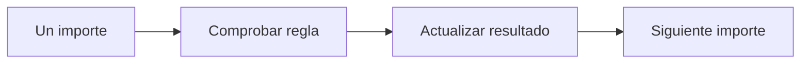

# Decisiones y repeticiones

## Objetivos y prerrequisitos

Aplicarás una regla distinta según un dato y repetirás una comprobación sobre varios pedidos. Requiere listas y diccionarios.

## Condiciones: expresar una regla

Una condición permite que el programa elija. `if` pregunta por una expresión que da `True` o `False`:

```python
importe = 120
if importe >= 100:
    categoria = "pedido alto"
else:
    categoria = "pedido habitual"
```

La sangría no es decoración: las líneas desplazadas pertenecen a la rama de la condición. La regla debe coincidir con una definición de negocio. Pregunta si exactamente 100 debe contarse como alto antes de decidir entre `>` y `>=`.

## Bucles: repetir sin copiar código

Un bucle `for` visita cada elemento de una colección. El siguiente acumula importes y muestra la idea de agregación que luego hará Pandas:

```python
total = 0
for importe in [12.5, 18.0, 7.2]:
    total = total + importe
print(total)
```

Este flujo responde a “¿qué ocurre para cada dato de entrada?”



El programa repite el mismo criterio; no decide de forma inteligente qué regla usar. La calidad de la conclusión depende de que la regla y los datos sean apropiados.

## Error habitual

No modifiques una lista mientras la recorres salvo que entiendas las consecuencias: puedes saltarte elementos. Para aprender, crea una lista nueva para los resultados o revisa primero el tamaño y contenido de la original.

## Resumen

Las condiciones expresan criterios y los bucles los aplican repetidamente. Sigue con [funciones](04-funciones-y-alcance.md).
