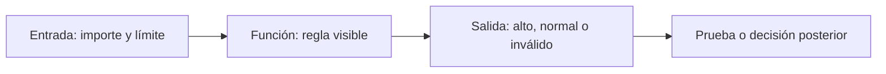

# 04 - Funciones, contratos, módulos y alcance

## Resultado observable y prerrequisitos

Crearás funciones pequeñas con entradas, salida y casos límite definidos; usarás argumentos opcionales, `return`, docstrings y comprobaciones. Requiere condiciones y bucles.

## Una función es un contrato comprobable

Repetir `if importe >= 100` en varias celdas invita a que cada copia use un límite diferente. Una función nombra la regla y publica su contrato: qué acepta, qué devuelve y qué no hace.

```python
def clasificar_importe(importe, limite=100):
    """Devuelve 'alto' si importe es numérico y alcanza limite; si no, devuelve 'invalido'."""
    if not isinstance(importe, (int, float)):
        return "invalido"
    if importe >= limite:
        return "alto"
    return "normal"
```

`importe` y `limite` son parámetros. `limite=100` es un argumento opcional: la persona que llama puede usar el valor por defecto o indicar otro. `return` entrega un resultado y termina la función; `print` solo lo muestra en pantalla. Por eso una función analítica debe normalmente devolver datos y dejar que otra parte decida cómo presentarlos.



## Pruebas mínimas: normal, límite y dato inválido

Un ejemplo no demuestra que una regla funcione. Comprueba al menos un caso normal, el borde y una entrada inválida:

```python
assert clasificar_importe(99) == "normal"
assert clasificar_importe(100) == "alto"
assert clasificar_importe("100") == "invalido"
assert clasificar_importe(150, limite=200) == "normal"
```

`assert` detiene la ejecución si la afirmación es falsa. No sustituye una suite profesional de tests, pero impide confiar en una salida bonita sin comprobar la regla. Un `AssertionError` es evidencia de que la expectativa y el código no coinciden.

## Alcance y efectos secundarios

Los nombres creados dentro de una función son locales. Pasar datos como parámetros hace visible de qué depende la regla:

```python
LIMITE_GLOBAL = 100

def es_revisable(importe, limite):
    return importe >= limite
```

Evita que `es_revisable` lea `LIMITE_GLOBAL` sin recibirlo: cambiar una variable global en otra celda podría alterar resultados sin que la llamada lo muestre. Evita además modificar una lista recibida salvo que el contrato lo anuncie; es preferible devolver una nueva estructura o documentar el efecto.

## Módulos, imports, script y notebook

Un **módulo** es un archivo Python que contiene funciones reutilizables. `import math` carga un módulo de la biblioteca estándar; `from math import ceil` importa un nombre concreto. No nombres tu archivo `math.py`, porque ocultaría el módulo oficial. Un script puede proteger su ejecución principal:

```python
def main():
    print(clasificar_importe(120))

if __name__ == "__main__":
    main()
```

Al ejecutar el archivo directamente se llama a `main`; al importarlo desde otro archivo se obtienen las funciones sin ejecutar el informe. Un notebook es útil para explorar; un módulo reduce copias cuando una regla ya está estable.

## Microprácticas y resumen

1. Cambia el límite por defecto a 75 y prueba una llamada que lo sobrescriba.
2. Escribe `es_pedido_valido(pedido)` que devuelva `True` solo si contiene id, importe numérico positivo y estado confirmado.
3. Añade tres `assert` antes de confiar en ella.
4. Explica qué diferencia hay entre devolver una lista y hacer `print(lista)`.

Una función clara permite localizar fallos. La próxima lección enseña a distinguir los errores que Python señala y los resultados erróneos que Python no puede adivinar.
