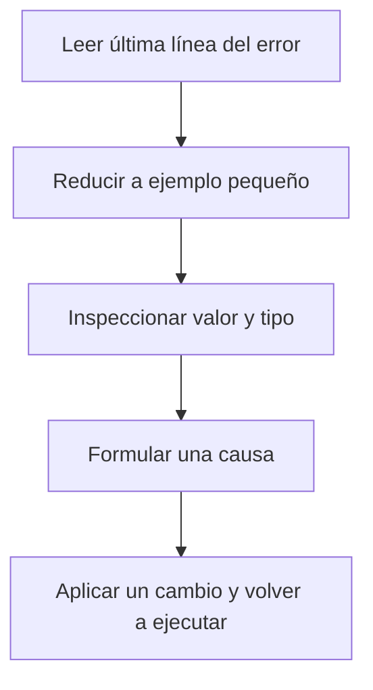

# Errores y depuración

## Objetivos y prerrequisitos

Sabrás leer el mensaje de error, formular una hipótesis mínima y comprobarla sin cambiar diez cosas a la vez. Requiere haber ejecutado código sencillo.

## Un error también es evidencia

Cuando Python no puede continuar, muestra un mensaje con una última línea relevante. `NameError` suele indicar que un nombre no existe; `TypeError`, que se intentó una operación incompatible; `KeyError`, que falta una clave del diccionario. El mensaje no sustituye la comprensión, pero delimita qué revisar.

Ejemplo:

```python
importe = "42.50"
importe + 10
```

El problema no es que Python “falle”: `importe` contiene texto, no un número. La corrección solo debe hacerse si la regla de origen confirma que ese texto representa un importe válido:

```python
importe_numerico = float(importe)
```

## Método de depuración

Este flujo responde a “¿cómo investigar sin adivinar?”



Reducir el ejemplo evita mezclar varios problemas. Usa `print(valor)` y `type(valor)` antes de cambiar código. Si la causa es un dato inesperado, no la tapes con una conversión automática: registra cuántos casos hay y decide qué significan.

## Error habitual: silenciar en lugar de entender

`try/except` permite manejar errores, pero capturarlos todos y continuar puede ocultar importes inválidos o pedidos perdidos. Úsalo para casos esperados y registra qué ocurrió. Un análisis correcto que descarta silenciosamente el 20 % de los datos no es fiable.

## Resumen

Depurar es un proceso de evidencia: leer, aislar, inspeccionar, probar. Continúa con [estilo y práctica](06-estilo-y-practica-gastos.md).
