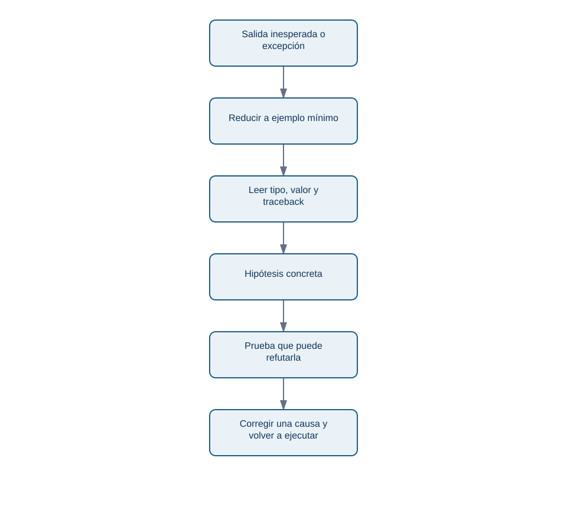
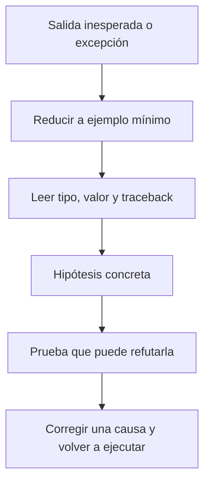

# 05 - Errores, pruebas y depuración basada en evidencia

## Resultado observable y prerrequisitos

Sabrás leer el final de un traceback, aislar un fallo, distinguir errores de sintaxis y de datos, y manejar solo excepciones esperadas. Requiere haber ejecutado funciones sencillas.

## El traceback es un mapa, no una acusación

Un **traceback** es la ruta de llamadas que Python muestra cuando no puede continuar. La última línea nombra normalmente el tipo y la causa inmediata. Léela primero, luego vuelve a la línea de tu código indicada.

| Error | Ejemplo típico | Pregunta útil |
| --- | --- | --- |
| `SyntaxError` | Falta `:` o paréntesis | ¿Python puede interpretar el programa? |
| `NameError` | Usar `importe` antes de asignarlo | ¿Ejecuté la definición y escribí el nombre igual? |
| `IndexError` | `pedidos[3]` en lista de tres | ¿Existe esa posición? |
| `KeyError` | `pedido["importe"]` sin clave | ¿El contrato exige ese campo? |
| `ValueError` | `float("cuarenta")` | ¿El valor tiene forma válida para esa conversión? |
| `TypeError` | `"42" + 5` | ¿Las operaciones son compatibles con los tipos? |

Un programa puede no lanzar excepciones y aun así estar equivocado: usar `>` en lugar de `>=` en el umbral de Lumen cambia la clasificación de 100 EUR sin que Python proteste. Por eso se combinan traceback y pruebas de casos límite.

<!-- mobile-diagram: rendered fallback -->


<details>
<summary>Ver código Mermaid editable</summary>


</details>

La corrección se hace después de entender la causa; cambiar cinco líneas a la vez impide saber cuál resolvió el problema.

## Validar cerca de la entrada

El laboratorio recibe eventos de una fuente simulada. Conviene transformar o rechazar un valor justo al llegar, no cuando el total ya es extraño:

```python
def leer_importe(pedido):
    try:
        importe = float(pedido["importe"])
    except KeyError as error:
        raise ValueError("El pedido no contiene importe") from error
    except (TypeError, ValueError) as error:
        raise ValueError("El importe debe ser numérico") from error
    if importe <= 0:
        raise ValueError("El importe debe ser positivo")
    return importe
```

Capturamos excepciones concretas porque son esperables en esta frontera. `except Exception: pass` sería mala práctica: silencia también problemas de programación y puede dejar un informe incompleto sin aviso. La excepción se traduce a un mensaje de negocio, pero se conserva la causa con `from error`.

## `assert` y registro de incidencias

Usa `assert` para afirmar un comportamiento que el programador espera durante desarrollo. Para datos que vienen de fuera, una excepción controlada o una incidencia suele ser mejor que detener toda la auditoría:

```python
incidencias = []
for pedido in pedidos:
    try:
        importe = leer_importe(pedido)
    except ValueError as error:
        incidencias.append({"id": pedido.get("id", "sin_id"), "motivo": str(error)})
        continue
```

Esto no «arregla» el origen. Permite calcular un total de pedidos válidos y comunicar cuántos se excluyeron. Un analista debe informar ambos números; de lo contrario, la cifra parece más precisa de lo que es.

## Microprácticas

1. Provoca un `SyntaxError` eliminando dos puntos tras `if`; restaura el código y explica qué esperaba Python.
2. Crea una lista con dos pedidos e intenta acceder a `pedidos[2]`. ¿Por qué es `IndexError` y no `KeyError`?
3. Haz que `leer_importe({"importe": "--"})` lance `ValueError`; comprueba el mensaje.
4. Escribe un `assert` para el borde: un importe 0 no es válido.

Depurar consiste en producir evidencia sobre una hipótesis. En el laboratorio final reunirás datos válidos, incidencias, pruebas y una salida que otra persona pueda revisar.
