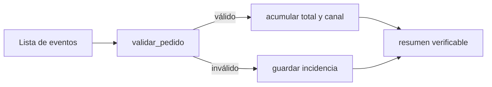

# 06 - Laboratorio: auditoría reproducible de pedidos

## Resultado observable y prerrequisitos

Construirás y ejecutarás una auditoría pequeña de Lumen: entradas simuladas, reglas explícitas, incidencias, totales y pruebas. Requiere las cinco lecciones anteriores.

## El problema operativo

Producto quiere conocer el importe confirmado del día. Ingeniería advierte que algunos eventos llegan con texto en lugar de número, importe cero o estado inesperado. Informar únicamente un total sería engañoso: también hay que comunicar qué quedó fuera y por qué.

El [laboratorio ejecutable](../../../notebooks/practicas/02-auditoria-pedidos.py) separa cuatro responsabilidades:



Separar funciones no es estética: permite probar la validación sin depender de la presentación del resumen.

## Lectura guiada del laboratorio

Primero observa `PEDIDOS_DEMO`. Es una lista deliberadamente pequeña con pedidos correctos, un importe de texto convertible, un importe cero, una clave ausente y un pedido cancelado. Después ejecuta las pruebas `assert`: si una falla, no continúes al resumen; la regla ha cambiado o está mal implementada.

La función `validar_pedido` devuelve una copia normalizada del pedido válido o lanza `ValueError` con una explicación. `auditar_pedidos` no oculta la excepción: la convierte en una incidencia con id y motivo. La salida esperada de los datos demo es:

```text
Pedidos válidos confirmados: 2
Importe confirmado: 160.50 EUR
Por canal: {'web': 120.5, 'app': 40.0}
Incidencias: 4
```

El pedido cancelado aparece como incidencia porque este informe tiene el contrato «solo confirmados». En otro informe podría contarse como estado separado; no hay una respuesta universal, sí debe haber una definición visible.

## Estilo que protege el análisis

- Usa nombres que expresen unidad y significado: `importe_confirmado`, no `resultado`.
- Declara límites (`LIMITE_REVISION = 100`) en lugar de números mágicos repartidos.
- No mezcles lectura, validación, cálculo y `print` en un bucle enorme.
- Devuelve datos desde las funciones; imprime solo en el borde del programa.
- Conserva incidencias y recuentos. Un valor excluido sin rastro es una fuga de trazabilidad.

No basta con que una salida coincida una vez. Cambia un pedido demo para que valga 100, añade un canal nuevo y prueba una lista vacía. El programa debe responder de forma definida, no por accidente.

## Ejercicio de cierre

Resuelve [Auditoría de pedidos de Lumen](../../../ejercicios/temario-02/aplicacion/gastos-personales.md). Incluye un estado adicional y un límite de revisión; luego compara tu razonamiento con la [solución](../../../soluciones/temario-02/gastos-personales.md). Si estudias desde móvil, copia por partes el script en Colab o redacta primero el contrato de cada función, sus entradas y salidas esperadas.

## Puente a NumPy y Pandas

Aquí recorres una lista pedido por pedido para comprender el control. NumPy y Pandas aplicarán operaciones parecidas a muchas filas, pero las preguntas no desaparecen: ¿qué es válido?, ¿qué se excluyó?, ¿qué significa cero?, ¿puedo reproducir el resultado? Lleva estas preguntas al bloque 04 y, especialmente, al bloque 05.
