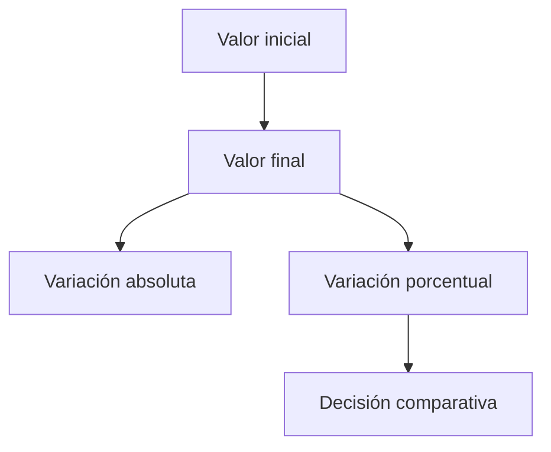

# Bloque 03 - Matemáticas aplicadas al análisis

## Objetivo

Conectar las herramientas matemáticas con decisiones de negocio y análisis. La teoría general es opcional para quien ya tenga una base universitaria sólida; las aplicaciones sí forman parte del oficio de analista.

## Diagnóstico rápido

Puedes avanzar directamente si manejas porcentajes, tasas de variación, medias ponderadas, funciones y vectores. Si algo resulta familiar pero oxidado, repásalo aquí antes de entrar en estadística.

## Porcentajes y tasas

Un cambio de 100 a 120 es un aumento del 20 %. Un descenso posterior del 20 % no devuelve el valor al origen: 120 x 0,8 = 96. Este detalle importa al comunicar crecimiento, conversión o churn.

La media ponderada evita dar el mismo peso a grupos de tamaño muy distinto. Si dos países convierten al 80 % y 10 %, pero tienen 10 y 10 000 visitantes, la media simple sería engañosa.

## Funciones, vectores y matrices

Una función transforma una entrada en una salida: por ejemplo, `ingresos(clientes, precio)`. Un vector reúne medidas de una observación y una matriz reúne muchas observaciones. NumPy y Pandas usarán estas ideas para calcular sobre miles de filas a la vez.

## Crecimiento y tiempo

Separa nivel, cambio absoluto, cambio porcentual y crecimiento compuesto. Si una métrica tiene estacionalidad, comparar solo con el mes anterior puede ser una mala referencia; compara también con el mismo periodo del año anterior.

## Resumen

Las matemáticas no son un bloque aislado: sirven para definir métricas, detectar comparaciones injustas y explicar magnitudes con precisión.
