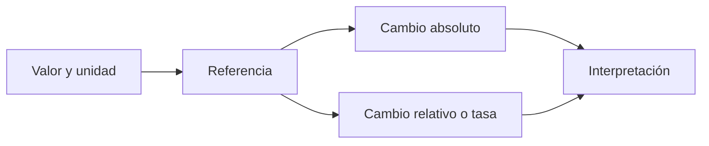

# Magnitudes, porcentajes y tasas

## Objetivos y prerrequisitos

Sabrás separar cambio absoluto, cambio relativo y puntos porcentuales. La aritmética básica es suficiente; si ya dominas fórmulas, céntrate en los ejemplos y errores de interpretación.

## Una cifra necesita unidad y referencia

Pasar de 100 a 120 pedidos supone un cambio absoluto de 20 pedidos y un crecimiento relativo del 20 %: `(120 - 100) / 100`. Ambas cifras son correctas, pero responden preguntas distintas. El cambio absoluto ayuda a estimar capacidad; el relativo permite comparar grupos de tamaño distinto.

Una tasa relaciona cantidades: por ejemplo, 30 compras de 1 000 visitas son una tasa de conversión del 3 %. No digas “subió un 2 %” si pasó de 3 % a 5 %: aumentó **2 puntos porcentuales** y aproximadamente un 66,7 % relativo. Esa diferencia cambia la percepción de impacto.

Este recorrido responde a “¿qué debe declararse antes de comparar un número?”

La referencia puede ser ayer, el objetivo, otro segmento o el mismo mes del año anterior; elegirla es una decisión analítica, no una operación automática.

## Ejemplo y contraejemplo

Una app pasa de 10 a 20 conversiones: +10 conversiones y +100 %. Otra pasa de 10 000 a 10 100: +100 conversiones pero +1 %. Presentar solo porcentaje hace enorme el primer cambio; presentar solo conteo oculta que el segundo afecta a más clientes. Comunica ambos cuando importen.

Un descenso del 20 % después de un aumento del 20 % no vuelve al inicio: `100 × 1,2 × 0,8 = 96`. Los porcentajes se aplican a bases distintas.

## Resumen y práctica

- Declara unidad, población y referencia.
- Distingue porcentaje, tasa y punto porcentual.
- El tamaño de la base cambia la interpretación.

Calcula el cambio absoluto, relativo y en puntos porcentuales si una conversión pasa de 4 % a 5 %. Luego sigue con [ponderación](02-promedios-ponderacion-y-agregacion.md).
