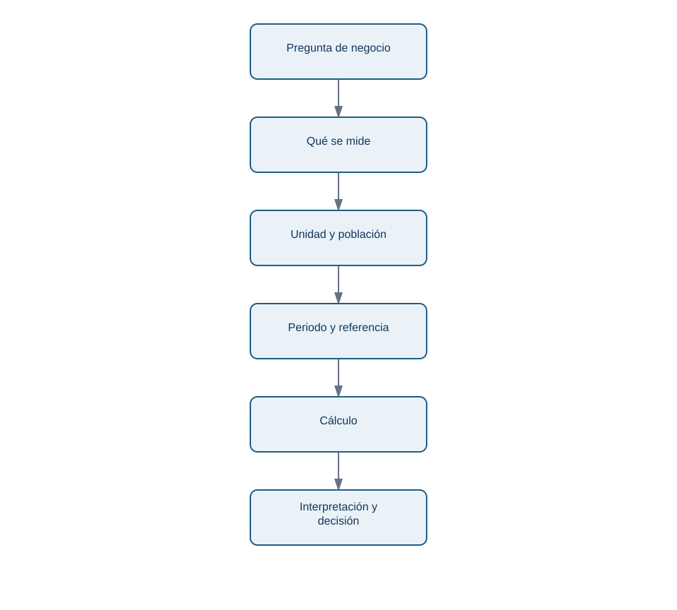

# 01. Magnitudes, unidades, porcentajes y tasas

## Objetivo y prerrequisitos

Al terminar distinguirás una cantidad, su unidad y su referencia; calcularás cambio absoluto, relativo, tasa y puntos porcentuales. Basta con aritmética básica. Una **magnitud** es algo medible (pedidos, euros, minutos); su **unidad** expresa cómo se cuenta (pedidos, EUR, minutos).

## El problema antes de la fórmula

El lunes Nexo recibe 1.200 pedidos y el martes 1.320. Decir solamente "subieron 120" no dice si se trata de pedidos, euros o minutos, ni frente a qué periodo se compara. La descripción mínima es: *pedidos confirmados por día, España, martes frente a lunes*. Esa frase funciona como contrato de la cifra.

| Día | Pedidos confirmados | Facturación | Tiempo medio de entrega |
| --- | ---: | ---: | ---: |
| Lunes | 1.200 pedidos | 24.000 EUR | 31 min |
| Martes | 1.320 pedidos | 26.400 EUR | 36 min |

El cambio absoluto de pedidos es `1.320 - 1.200 = +120 pedidos`. El cambio relativo usa una **base**: `(1.320 - 1.200) / 1.200 = 0,10 = 10 %`. El primero ayuda a prever repartidores; el segundo compara mercados de distinto tamaño.

Este esquema responde: "¿qué hay que fijar antes de comparar?"

<!-- mobile-diagram: rendered fallback -->

Ver código Mermaid editable

Sin población y periodo, el mismo número puede tener significado opuesto. Un incremento de 120 pedidos diarios sí exige revisar capacidad; 120 pedidos más en todo un año quizá no.

## Porcentaje, tasa y puntos porcentuales

Una **proporción** es una parte dividida entre un total compatible. Si 66 de 1.320 pedidos terminan cancelados, la tasa de cancelación es `66 / 1.320 = 5 %`. Una **tasa** relaciona dos cantidades con un denominador explícito: pedidos por hora, incidencias por 1.000 pedidos o conversiones por visita.

Si la conversión pasa de 3 % a 5 %, aumenta **2 puntos porcentuales (pp)**, porque `5 % - 3 % = 2 pp`. Relativamente aumenta `(5 - 3) / 3 = 66,7 %`. Ambas formas son correctas y responden a preguntas distintas. Nunca llames "2 %" a los 2 pp: borra la base y puede inducir a error.

### Ejemplo trabajado: ¿creció el negocio?

Nexo pasa de 1.200 a 1.320 pedidos y de 24.000 a 26.400 EUR. El valor medio por pedido es `24.000 / 1.200 = 20 EUR` ambos días. Facturación y pedidos crecen al 10 %, no porque cada pedido valga más sino porque entran más pedidos. A la vez, el tiempo de entrega aumenta 5 min, un empeoramiento absoluto de 5 min y relativo de `5 / 31 = 16,1 %`. Una presentación honesta contiene ambos lados.

## Unidades, dimensiones y conversiones

Una **dimensión** describe la clase física o lógica de una cantidad: dinero, tiempo, pedidos o personas. Solo se suman magnitudes de la misma dimensión: `24.000 EUR + 26.400 EUR` tiene sentido; `1.320 pedidos + 36 min`, no. Dividir sí crea una tasa: `1.320 pedidos / 24 horas = 55 pedidos/hora`.

Convierte antes de operar. Si una fuente usa minutos y otra segundos, `36 min = 2.160 s`. Mezclar moneda, IVA incluido/no incluido o zonas horarias produce errores que una fórmula correcta no arregla.

## Límites y errores frecuentes

- Un descenso del 20 % tras un aumento del 20 % no vuelve al origen: `100 × 1,20 × 0,80 = 96`. Los porcentajes usan bases diferentes.
- Una tasa con denominador cero no se define. No sustituyas por 0 sin marcarlo: quizá no hubo visitas o falta el dato.
- Un 100 % sobre dos observaciones puede ser poco relevante. Comunica también el numerador y denominador.
- La tasa no demuestra causa. Una conversión mayor durante una campaña no prueba que la campaña la haya causado.

## Resumen y comprobación

1. ¿Qué especificarías antes de publicar "la conversión subió"?
2. Si pasa de 8 % a 10 %, ¿cuántos pp y qué crecimiento relativo representa?
3. ¿Por qué `pedidos/día` y `pedidos totales` no responden igual a capacidad?

Continúa con [cómo resumir muchos días sin ocultar variabilidad](02-descriptiva-y-distribuciones.md).
