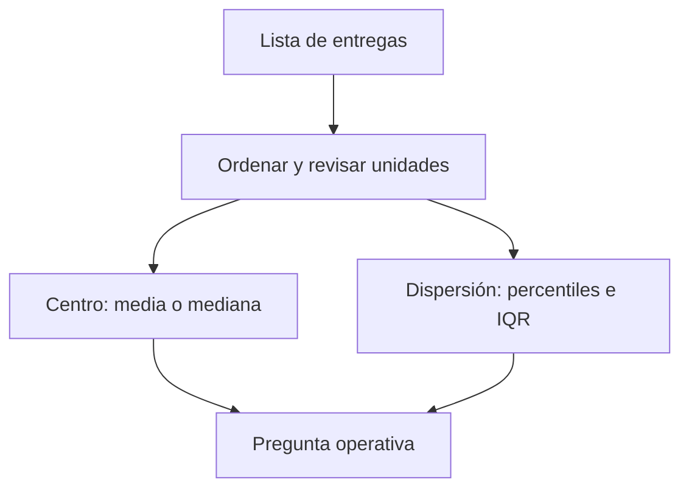

# 02. Describir una distribución: centro, dispersión y percentiles

## Resultado observable

Podrás resumir los tiempos de entrega de Nexo sin confundir un día típico con un día problemático. Conocerás media, mediana, percentiles, rango intercuartílico (IQR) y desviación estándar; no necesitas estadística previa.

## De una lista a una pregunta operativa

Una **distribución** es el conjunto de valores que toma una variable y la frecuencia con que aparece. Nexo observa los minutos de entrega de siete pedidos: `22, 24, 25, 26, 27, 28, 80`. La lista no es cómoda para una reunión; resumirla permite responder "¿qué experiencia recibe la mayoría?" y "¿hay colas extremas?".

La **media** suma y divide por el número de valores: `232 / 7 = 33,1 min`. La **mediana** es el valor central al ordenar: `26 min`. El pedido de 80 minutos arrastra la media, pero no la mediana. Ninguno de los dos números es "el correcto" fuera de contexto: la media sirve para estimar minutos totales de capacidad; la mediana describe mejor una entrega típica cuando existen extremos.

El diagrama separa dos preguntas. Un centro alto puede deberse a que todos empeoran o a unos pocos pedidos muy tardíos; la dispersión lo aclara.

## Percentiles e IQR

Un **percentil p** deja aproximadamente el `p %` de observaciones por debajo. Si el p90 de entrega es 45 min, nueve de cada diez pedidos se entregan en 45 minutos o menos; no significa que el 90 % tarde exactamente 45. El p50 coincide con la mediana. El p25 y p75 delimitan la mitad central; `IQR = p75 - p25` es el rango intercuartílico.

Para una muestra grande de Nexo, `p25=24`, `p50=29`, `p75=38`, `p90=52`. El IQR es `14 min`. Producto puede prometer una experiencia típica cercana a 29 min, mientras Operaciones investiga por qué el 10 % más lento supera 52 min. Publicar solo una media de 31 min ocultaría este riesgo.

## Desviación estándar, con cautela

La **varianza** mide la distancia media cuadrática al promedio; la **desviación estándar** es su raíz y vuelve a la unidad original. Si la media es 30 min y la desviación estándar es 2 min, los tiempos son mucho más homogéneos que con 15 min. Pero esa lectura de "media ± desviación" es especialmente interpretable si la distribución es aproximadamente simétrica y sin colas graves. En entregas con retrasos extremos, percentiles e IQR suelen comunicar mejor el servicio.

No uses un valor atípico automáticamente como error. Un pedido de 80 min puede ser una tormenta, una dirección errónea o un fallo de registro. Primero conserva su identificador, revisa la causa y decide si se analiza por separado.

## Segmentos y comparabilidad

Una distribución agregada puede mezclar centros urbanos y rurales. Si Madrid tiene mediana 26 min y una zona periférica 42 min, una mediana nacional de 29 min no responde qué debe arreglar cada equipo. Segmenta solo cuando la variable cambia la decisión, manteniendo suficientes observaciones y el mismo periodo.

## Resumen y comprobación

- Media: carga/coste promedio; sensible a extremos.
- Mediana y percentiles: experiencia típica y cola de servicio.
- IQR/desviación: variabilidad, no causalidad.

1. ¿Qué usarías para un SLA: media o p90, y por qué?
2. ¿Puede bajar la media mientras empeora p90? Describe un caso.
3. ¿Qué comprobarías antes de borrar un valor de 80 min?

La siguiente lección explica cómo resumir grupos sin dar a cada fila el mismo peso por error.
