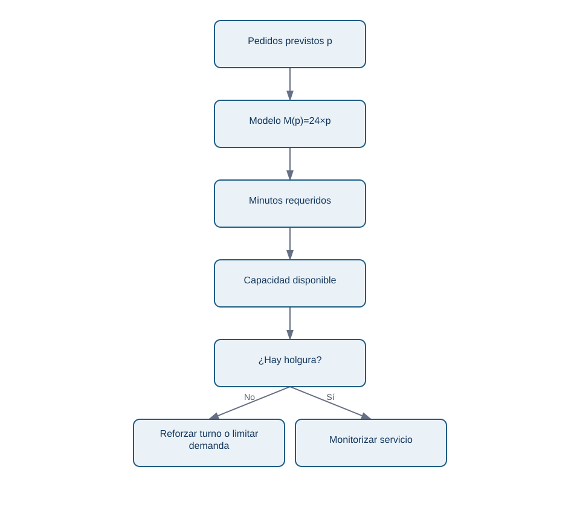

# 04. Funciones y modelos sencillos para decisiones

## Objetivo

Representarás una relación entre entradas y salida como una **función**: una regla que asigna una salida a cada entrada válida. Usarás esta idea para planificar capacidad sin confundir una relación observada con una causa demostrada.

## El modelo mínimo

Nexo estima minutos de trabajo de reparto como `M(p) = 24 × p`, donde `p` son pedidos y 24 es una estimación de minutos por pedido. Para 1.320 pedidos, `M(1320)=31.680 minutos`. Dividir por 480 minutos disponibles por repartidor/día da 66 repartidores-equivalentes antes de descansos e incidencias.

La entrada `p` tiene unidad pedidos; el coeficiente `24` tiene unidad minutos/pedido; la salida tiene minutos. Este chequeo dimensional detecta fórmulas absurdas.

<!-- mobile-diagram: rendered fallback -->


<details>
<summary>Ver código Mermaid editable</summary>

```mermaid
flowchart LR
  A[Pedidos previstos p] --> B[Modelo M(p)=24×p]
  B --> C[Minutos requeridos]
  C --> D[Capacidad disponible]
  D --> E{¿Hay holgura?}
  E -->|No| F[Reforzar turno o limitar demanda]
  E -->|Sí| G[Monitorizar servicio]
```
</details>

El modelo convierte una previsión en una decisión, no en una verdad. Sus supuestos deben quedar visibles.

## Pendiente, intercepto y linealidad

Una forma frecuente es `y = a + b x`. `a` es un valor base y `b` es la **pendiente**, el cambio esperado de `y` por una unidad de `x`. Si el tiempo total incluye 600 min fijos de preparación y 24 min por pedido, `M(p)=600+24p`.

La linealidad es una aproximación. Con tráfico, saturación o zonas lejanas, el minuto por pedido puede aumentar cuando crece `p`. Un modelo lineal sencillo es útil como baseline y para comunicar, pero debe contrastarse con datos y no extrapolarse fuera del rango observado.

## Funciones por tramos y reglas de negocio

Nexo cobra 2 EUR de entrega hasta 15 EUR de cesta y entrega gratis desde 15 EUR. Esto es una función por tramos: la salida depende del intervalo de la entrada. Las reglas de negocio deben documentar frontera e inclusividad (`>=15`), porque cambiar un símbolo puede afectar a miles de pedidos.

## Asociación no es causalidad

Si los pedidos y las demoras crecen juntos, puede haber saturación, pero también lluvia o una campaña. La función describe o predice una relación; no prueba que cambiar pedidos cause el efecto. Para causalidad harán falta diseño experimental o métodos del bloque 14.

## Comprobación

1. Indica unidades de cada término de `600 + 24p`.
2. ¿Qué supuesto rompería este modelo durante lluvia intensa?
3. ¿Por qué una función útil no demuestra causalidad?

En la siguiente lección aplicarás la misma regla a muchas observaciones de una vez.
