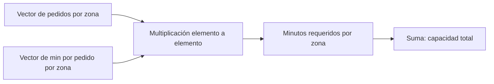

# 05. Vectores, matrices y cálculo por lotes

## Objetivo y puente a NumPy

Un **vector** es una lista ordenada de números del mismo tipo conceptual; una **matriz** es una tabla rectangular de números. Estas estructuras permiten aplicar una operación a muchas filas y preparan el pensamiento vectorial de NumPy (bloque 04).

## Del pedido individual al vector

Para tres zonas, los pedidos son `p = [120, 80, 100]` y los minutos medios por pedido son `t = [22, 30, 26]`. Multiplicar componente a componente produce minutos por zona: `[2640, 2400, 2600]`; sumarlos da 7.640 minutos. El orden importa: la primera posición de ambos vectores debe representar la misma zona. Si una fuente ordena zonas distinto, el resultado parece matemático pero es falso.

El diagrama muestra una condición oculta: las posiciones deben estar alineadas por una clave de zona, no solo por su posición.

## Matriz: varias variables o relaciones

Una matriz puede tener filas de zonas y columnas de franja horaria. Por ejemplo, la fila de Centro `[30, 45, 35]` puede representar pedidos de mañana, comida y noche. Sumar por fila responde carga por zona; sumar por columna responde carga por franja. El **eje** que se suma cambia la pregunta.

Otra matriz puede representar costes de asignar repartidores a zonas. No hace falta memorizar álgebra lineal avanzada ahora: importa comprender que una dimensión representa entidades y otra variables, y que las etiquetas deben viajar con los números.

## Operaciones seguras y límites

La **multiplicación matricial** combina filas de una matriz con columnas de otra; solo es válida si las dimensiones interiores coinciden. En la práctica, una incompatibilidad de tamaños suele avisar de que se han mezclado variables o periodos. NumPy hará estas operaciones rápido, pero no conoce el significado de las columnas.

Evita confundir multiplicación elemento a elemento con matricial. `[120,80] * [22,30]` equivale a dos productos por zona; no es un cruce de asignaciones. Comprueba forma, unidad y clave antes de automatizar.

## Comprobación

1. ¿Qué representan filas y columnas de una matriz de pedidos por zona y hora?
2. ¿Qué falla si el vector de tiempos usa un orden de zona diferente?
3. ¿Qué suma usarías para conocer carga por franja?

El [laboratorio](../../../notebooks/practicas/03-matematicas-nexo.py) reproduce estas operaciones con listas de Python.
