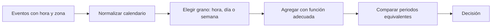

# 06. Tiempo, granularidad, crecimiento y ventanas

## Objetivo

Sabrás definir un periodo comparable y calcular crecimiento sin mezclar días incompletos, zonas horarias ni granularidades. Una **granularidad** es el tamaño de cada intervalo: pedido, hora, día, semana o mes.

## El mismo fenómeno visto a distinta escala

Nexo registra cada pedido a las 23:30 UTC. En España puede pertenecer al día siguiente local. Antes de agrupar por día hay que fijar zona horaria y regla de corte. Después, una fila diaria puede contener total de pedidos, ingresos y p90 de entrega; una fila semanal resume siete días, pero ya no permite estudiar la hora punta.

La ventana temporal es parte de la definición de una métrica. Cambiarla cambia el valor y, con frecuencia, la conclusión.

## Crecimiento: base y periodo

El crecimiento intersemanal de 10.000 a 11.000 pedidos es 10 %. Para comparar demanda con patrón semanal, lunes contra lunes suele ser más justo que lunes contra domingo. Para campañas estacionales, conviene comparar con el mismo periodo del año anterior. En periodos largos, el crecimiento acumulado no se reparte linealmente: de 100 a 121 en dos meses equivale a 21 % total, no dos meses de 21 %.

Una **ventana móvil** resume los últimos `k` periodos. La media móvil de 7 días suaviza oscilaciones diarias, pero retrasa la detección de un cambio brusco. No uses datos futuros en una ventana destinada a una decisión de hoy; eso sería fuga de información y se trata a fondo en series temporales.

## Datos faltantes, ceros y días parciales

Un cero puede significar que no hubo pedidos; un valor ausente puede significar que el tracking falló. Son casos diferentes. Tampoco compares un día completo con el día actual a las 10:00. Etiqueta cobertura, fecha de extracción y definición de día antes de afirmar que cae la demanda.

## Resumen y comprobación

- El grano controla qué patrones se pueden observar.
- Una comparación exige poblaciones y ventanas equivalentes.
- Una media móvil reduce ruido y añade retraso.

1. ¿Qué perderías al pasar de pedidos por hora a pedidos semanales?
2. ¿Por qué el día actual puede parecer una caída artificial?
3. ¿Qué comparación harías para un lunes posterior a un festivo?

Resuelve ahora el [caso integrador](../../../ejercicios/temario-03/aplicacion/caso-nexo-capacidad.md).
