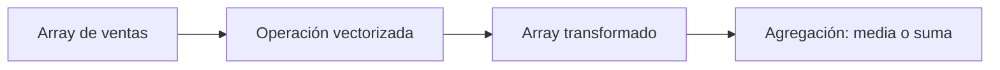

# Bloque 04 - NumPy y cálculo vectorizado

## Objetivo

Usar arrays para representar datos numéricos y aplicar cálculos de forma rápida, clara y reproducible.

## Arrays y vectorización

Un array almacena valores del mismo tipo en una estructura con forma definida. La vectorización aplica una operación a todos los elementos sin escribir un bucle explícito. Es útil porque expresa mejor la intención y suele ser más eficiente.

## Selección y máscaras

Una máscara booleana responde una pregunta para cada fila: `ventas > 100`. Después sirve para seleccionar solo los elementos que cumplen la condición. Esta idea reaparecerá en Pandas al filtrar DataFrames.

## Forma y broadcasting

La forma indica dimensiones: una serie puede tener forma `(n,)`, una tabla `(filas, columnas)`. Broadcasting permite combinar arrays compatibles, por ejemplo restar la media de cada columna a una matriz sin repetir la media manualmente.

## Reproducibilidad

Al simular datos aleatorios, fija una semilla. Así otra persona puede repetir el mismo experimento y comprobar el resultado.

## Resumen

Piensa en operaciones sobre colecciones completas, no en una fila cada vez. NumPy prepara el modelo mental para análisis tabular a escala.
