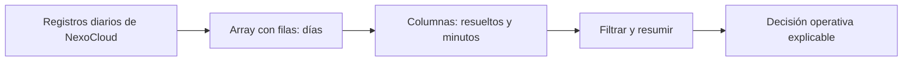

# Bloque 04 - NumPy y cálculo vectorizado

## Propósito

En este bloque Leo trabaja con el caso continuo de **NexoCloud**, una aplicación que registra para cada día las solicitudes resueltas, los minutos de respuesta y el canal de entrada. NumPy es una biblioteca de Python para guardar números en un **array** y calcular con muchos valores de una vez. No sustituye a saber qué mide cada número: hace más segura y breve la parte repetitiva cuando el significado ya está definido.

Al terminar podrás transformar una matriz de métricas operativas, seleccionar observaciones, detectar valores faltantes y explicar qué dimensión representa cada resultado. Es la base numérica sobre la que el bloque 05 construirá tablas con nombres de columnas usando Pandas.

## Resultados observables

- Crear arrays, leer su `dtype`, `ndim`, `shape` y tamaño sin confundirlos con su significado de negocio.
- Aplicar operaciones vectorizadas y reducciones por eje, comprobando unidades y denominadores.
- Extraer subconjuntos con índices, cortes y máscaras booleanas sin desalinear datos.
- Usar broadcasting conscientemente y reconocer el error de forma antes de que propague una regla equivocada.
- Tratar `NaN`, distinguir una vista de una copia y reproducir una simulación sencilla.

## Prerrequisitos y forma de trabajo

Se asume el vocabulario básico de Python del bloque 02: variable, lista, función y error. No se asume experiencia previa con bibliotecas. Puedes leer todo desde el móvil; para ejecutar el laboratorio usa un navegador con Google Colab o un entorno Python remoto. El script está en [notebooks/practicas/04-operaciones-nexocloud.py](../../notebooks/practicas/04-operaciones-nexocloud.py).

## Mapa del caso

La pregunta es: «¿qué canal requiere atención esta semana sin confundir días, métricas o datos ausentes?».

El array contiene posición; el diccionario de métricas del caso aporta significado. Mantendremos ambos durante todo el bloque.

## Lecciones

1. [Arrays, tipos y cálculo vectorizado](lecciones/01-arrays-y-vectorizacion.md)
2. [Forma, ejes e indexación](lecciones/02-seleccion-mascaras-y-forma.md)
3. [Máscaras, valores ausentes y copias](lecciones/03-mascaras-nan-y-copias.md)
4. [Broadcasting y reglas por canal](lecciones/04-broadcasting-y-reglas-por-canal.md)
5. [Simulación, reproducibilidad y laboratorio](lecciones/05-simulacion-y-laboratorio.md)

## Práctica evaluable

Resuelve el [diagnóstico operativo de NexoCloud](../../ejercicios/temario-04/diagnostico-operativo-nexocloud.md) antes de consultar la [solución razonada](../../soluciones/temario-04/diagnostico-operativo-nexocloud.md). La práctica no pide memorizar sintaxis: pide justificar formas, filtros, datos faltantes y una recomendación.
