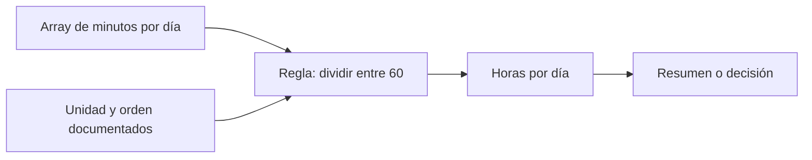

# Arrays, tipos y cálculo vectorizado

## Objetivos y prerrequisitos

Al terminar sabrás convertir valores numéricos en un array, comprobar el tipo que NumPy ha elegido y aplicar una misma regla a todos los valores. Necesitas conocer variables y listas de Python. Un **dato** es un valor que describe algo; una **colección** agrupa varios valores. NumPy resulta útil cuando esa colección tiene una estructura numérica conocida.

## El problema antes del nombre técnico

NexoCloud cerró 5, 8 y 6 solicitudes en sus tres primeros días de una prueba. Para calcular la carga total no hace falta recorrer cada número manualmente:

```python
solicitudes = [5, 8, 6]
```

Una lista es flexible: puede mezclar texto, números y otros objetos. Para cálculo científico conviene una estructura homogénea. Un **array de NumPy** (`numpy.ndarray`) es un bloque ordenado de elementos, normalmente de un tipo compatible, sobre el que las operaciones aritméticas se aplican elemento a elemento.

```python
import numpy as np

resueltas = np.array([5, 8, 6], dtype=np.int64)
minutos = np.array([42.5, 51.0, 47.5], dtype=float)
print(resueltas.dtype)  # int64: enteros
print(minutos.dtype)    # float64: números con decimales
```

`dtype` significa *data type*, el tipo con que el array guarda sus elementos. No es una etiqueta de negocio: `float64` no dice si 42.5 son euros, minutos o usuarios. Esa unidad debe documentarse fuera del array.

## Vectorizar: una regla, muchos elementos

Supón que el equipo quiere convertir minutos a horas para comparar el esfuerzo diario. La **vectorización** aplica una operación a cada posición correspondiente sin escribir un bucle explícito:

```python
horas = minutos / 60
objetivo_minutos = np.array([45.0, 45.0, 45.0])
desviacion = minutos - objetivo_minutos
```

El resultado de `minutos / 60` conserva tres posiciones. La tercera línea compara día con día porque los arrays tienen la misma longitud y el mismo orden. Es más fácil revisar «esta regla se aplica a todos los días» que repetir una instrucción manual por cada valor.

Este diagrama responde a «¿qué tiene que seguir siendo cierto para que una operación vectorizada signifique lo que creemos?»:



La flecha desde unidad y orden no es decorativa: sin ellos el cálculo puede ejecutarse y seguir siendo analíticamente falso.

## Reducciones: de muchos valores a un resumen

Una **reducción** resume varias posiciones en un resultado. `sum`, `mean`, `min` y `max` son comunes:

```python
total = resueltas.sum()       # 19 solicitudes
media = minutos.mean()        # 47.0 minutos
peor_dia = minutos.max()      # 51.0 minutos
```

La media no demuestra que cada cliente espere 47 minutos. Es una descripción de esos tres días y puede ocultar picos. Antes de comunicar «el servicio tarda 47 minutos», define el período, la población incluida y si una media es la medida adecuada.

## Conversión y pérdida de información

NumPy intenta encontrar un tipo común. Si introduces un decimal entre enteros, puede convertir todo el array a `float`; si introduces texto, puede convertir los números en texto. Forzar un tipo también puede perder información:

```python
np.array([42.9, 51.0], dtype=int)  # array([42, 51]); trunca, no redondea
```

No uses esta conversión para «limpiar» datos sin investigarlos. Truncar minutos puede sesgar un promedio y convertir identificadores como `"0012"` a entero puede borrar ceros significativos. Un identificador no es una magnitud para sumar.

## Resumen y comprobación

- Un array organiza valores con forma y tipo; la unidad de negocio no viaja sola en `dtype`.
- Vectorizar aplica una regla a cada elemento; presupone orden, unidad y población compatibles.
- Las reducciones resumen, pero no explican por sí solas la distribución.

Comprueba: ¿por qué `np.array([1, "2"])` es peligroso para una suma? ¿Qué hipótesis estás haciendo al restar dos arrays de igual longitud? En la siguiente lección verás cómo expresar qué representa cada dimensión.
