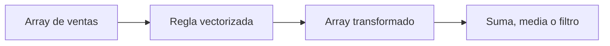

# Arrays y cálculo vectorizado

## Objetivos y prerrequisitos

Sabrás crear un array numérico y aplicar un cálculo a todos sus elementos. Requiere entender listas y vectores de los bloques 02 y 03.

## De una lista a un array

Un **array** es una estructura para valores organizados, normalmente del mismo tipo, que permite operaciones numéricas eficientes. En Python se importa NumPy con un alias convencional:

```python
import numpy as np
ventas = np.array([120, 140, 110])
ventas_con_iva = ventas * 1.21
```

La última línea no multiplica la lista como texto ni requiere un `for`: aplica la operación elemento a elemento. Eso se llama **vectorización**. Expresa “aplica la misma regla a cada venta”, una intención fácil de revisar.

Este flujo responde a “¿qué ocurre cuando la regla llega a una colección completa?”



## Límite analítico

Que una operación sea rápida no la hace correcta. Multiplicar por 1,21 solo procede si todos los valores comparten moneda, representan importes sin IVA y la regla de negocio aplica a todos. Vectorizar una mala regla propaga el error más deprisa.

## Resumen

Un array reúne números; la vectorización aplica una operación a cada uno. En la siguiente lección seleccionarás subconjuntos sin perder de vista el criterio usado.
