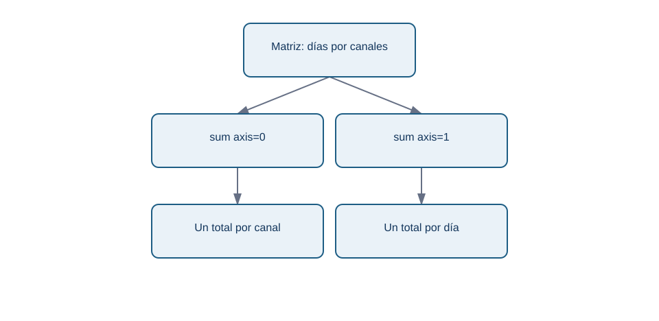
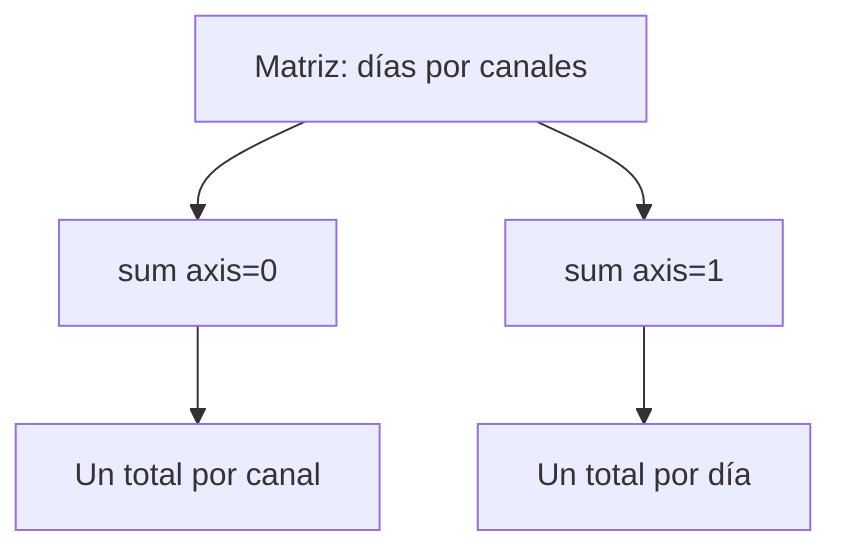

# Forma, ejes e indexación

## Objetivos y prerrequisitos

Aprenderás a leer una matriz como filas y columnas, resumir por la dirección correcta y seleccionar posiciones sin alterar su significado. Requiere arrays y operaciones vectorizadas del tema anterior.

## Una matriz necesita un contrato

Una lista de números no indica por sí sola qué representa cada posición. En NexoCloud registraremos cuatro días (filas) y tres canales (columnas: web, chat y correo). Cada celda es el número de solicitudes resueltas ese día por ese canal:

```python
import numpy as np

canales = np.array(["web", "chat", "correo"])
resueltas = np.array([
    [12, 8, 4],
    [15, 7, 5],
    [11, 9, 6],
    [13, 10, 4],
])
print(resueltas.shape)  # (4, 3): 4 días, 3 canales
print(resueltas.ndim)   # 2 dimensiones
```

`shape` es una tupla que enumera el tamaño de cada dimensión. No dice «días» ni «canales»: eso es parte del contrato que acabamos de escribir. Una matriz con forma `(4, 3)` también podría significar cuatro tiendas y tres productos. `ndim` cuenta dimensiones y `size` cuenta celdas: aquí `4 * 3 = 12`.

## Ejes: resumir hacia una dirección

En una matriz bidimensional, `axis=0` reduce las filas y conserva columnas; `axis=1` reduce las columnas y conserva filas. Es más seguro describirlo como «lo que queda» que memorizar una frase:

```python
por_canal = resueltas.sum(axis=0)  # [51, 34, 19], un total por canal
por_dia = resueltas.sum(axis=1)    # [24, 27, 26, 27], un total por día
```

La relación visual responde a «¿qué etiqueta conserva cada suma?»:

<!-- mobile-diagram: rendered fallback -->


<details>
<summary>Ver código Mermaid editable</summary>


</details>

`axis=0` no significa «mejor» ni «vertical» en abstracto; solo resulta correcto porque el contrato asignó filas a días y columnas a canales. Verifica la forma del resultado antes de asignarle un nombre.

## Índices y cortes

Python empieza a contar en cero. La sintaxis `[fila, columna]` selecciona una celda; los cortes `inicio:fin` incluyen el inicio y excluyen el final:

```python
primer_dia = resueltas[0, :]   # [12, 8, 4]
chat = resueltas[:, 1]         # [8, 7, 9, 10]
dos_primeros_dias = resueltas[:2, :]
```

La posición `1` solo significa chat porque `canales[1]` lo documenta. Si se reordena `canales` sin reordenar las columnas, el código seguirá funcionando y la conclusión será errónea. En tablas de producción, Pandas reduce este riesgo al usar etiquetas; aun así hay que validar las claves.

## Error habitual: forma válida, comparación inválida

Dos arrays pueden tener misma forma y referirse a períodos distintos. Restar las solicitudes de lunes a jueves a las de viernes a lunes entrega cuatro números, pero no mide una evolución comparable si los días no representan la misma condición. La forma comprueba compatibilidad técnica; no comprueba comparabilidad de negocio.

## Resumen y comprobación

- Documenta qué representa cada dimensión antes de usar `shape`.
- `axis=0` devuelve una medida por columna; `axis=1`, una medida por fila en este contrato.
- Los índices son posiciones, no etiquetas con significado propio.

Pregunta: si `resueltas.mean(axis=0)` tiene forma `(3,)`, ¿qué representa cada resultado? Continúa con máscaras para seleccionar por una condición explícita.
