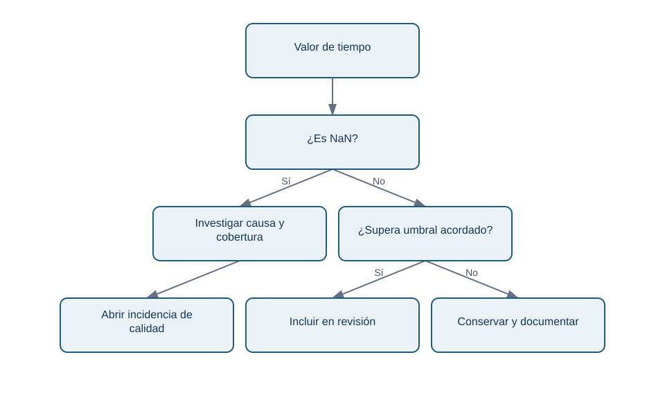
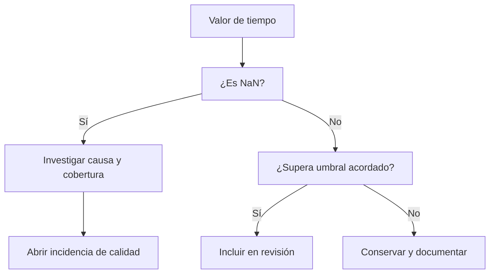

# Máscaras, valores ausentes y copias

## Objetivos y prerrequisitos

Sabrás construir una condición, usarla para seleccionar datos, reconocer un valor ausente y evitar modificar un array por accidente. Requiere entender `shape`, índices y operaciones de comparación.

## De una pregunta a una máscara

La responsable de soporte pregunta: «¿qué días superaron 50 minutos medios en chat?». Una **máscara booleana** es un array de `True` y `False`, uno por valor, que expresa esa pregunta:

```python
chat_minutos = np.array([48.0, 55.0, 51.0, 43.0])
supera_objetivo = chat_minutos > 50
print(supera_objetivo)          # [False, True, True, False]
print(chat_minutos[supera_objetivo])  # [55., 51.]
```

El umbral de 50 no lo inventa NumPy. Debe proceder de un acuerdo de nivel de servicio, un objetivo o una hipótesis explícita. Cambiarlo a 45 cambia la población seleccionada y, por tanto, la historia que se cuenta.

Para combinar requisitos usa `&` (y) y `|` (o), siempre entre paréntesis:

```python
es_lento = chat_minutos > 50
es_critico = chat_minutos >= 60
revisar = es_lento & ~es_critico
```

No escribas `es_lento and es_critico`: `and` pregunta por el array completo y no representa una comparación elemento a elemento.

## Ausencia no es cero

Un **valor ausente** significa que no conocemos o no recibimos el valor. En datos numéricos NumPy suele representarlo con `np.nan` (*not a number*). No equivale a cero: cero minutos sería una medida real que hay que interpretar; `NaN` dice que no hay medida utilizable.

```python
tiempo_chat = np.array([48.0, np.nan, 51.0, 43.0])
print(np.isnan(tiempo_chat))       # identifica el hueco
print(np.mean(tiempo_chat))        # nan: la ausencia se propaga
print(np.nanmean(tiempo_chat))     # 47.33..., ignora NaN
```

`np.nanmean` puede ser apropiado para un resumen exploratorio, pero no «arregla» el problema. Primero pregunta por qué faltó la medición: ¿falló el tracking, no hubo conversaciones o se retrasó la carga? Si los días de más tráfico son precisamente los ausentes, ignorarlos sesga el resultado.

## Vista frente a copia: una modificación con consecuencias

Un corte básico suele devolver una **vista**: comparte memoria con el array original. Una copia tiene memoria propia. La diferencia importa cuando limpias o pruebas transformaciones:

```python
original = np.array([48.0, 55.0, 51.0, 43.0])
vista = original[:2]
vista[0] = 999.0
print(original[0])  # 999.0: la vista modificó el original

seguro = original.copy()
seguro[0] = 48.0    # solo cambia seguro
```

No dependas de recordar todas las reglas de indexación avanzada. Si vas a alterar valores para una prueba o una imputación, llama explícitamente a `.copy()` y conserva el origen. Esto permite repetir la auditoría.

## Flujo de decisión para un dato sospechoso

<!-- mobile-diagram: rendered fallback -->


<details>
<summary>Ver código Mermaid editable</summary>


</details>

El flujo separa ausencia de rendimiento bajo: sustituir ambos por cero convertiría problemas distintos en el mismo número.

## Resumen y comprobación

- Una máscara deja visible el criterio de selección; valida su longitud y procedencia.
- `NaN` es desconocido, no un cero conveniente.
- Copia antes de modificar datos para análisis; documenta cualquier regla de tratamiento.

¿Qué respuesta adicional pedirías antes de usar `np.nanmean` para informar a dirección? En la siguiente lección aplicarás reglas distintas por canal sin duplicar la matriz.
