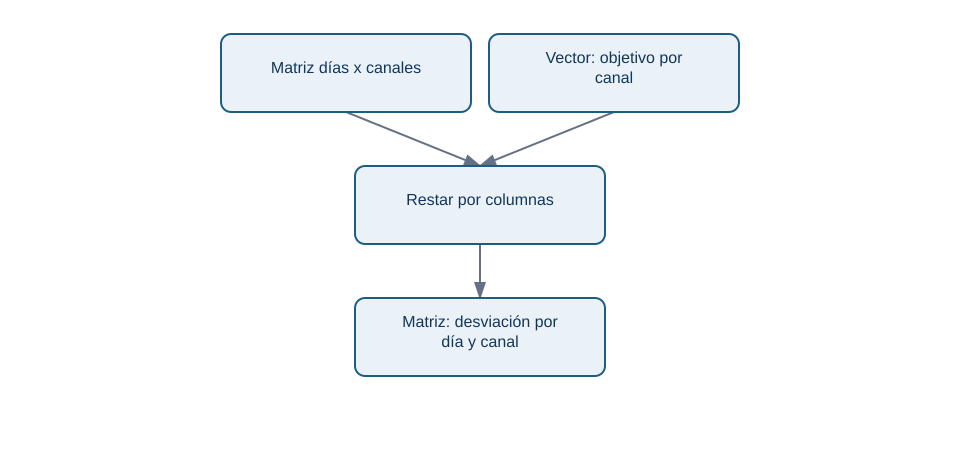

# Broadcasting y reglas por canal

## Objetivos y prerrequisitos

Aprenderás cuándo NumPy puede combinar dimensiones de forma segura y cómo detectar una regla aplicada sobre el eje equivocado. Requiere matrices, `shape` y operaciones vectorizadas.

## La necesidad: un objetivo distinto para cada canal

NexoCloud pacta objetivos de respuesta diferentes: web 40 minutos, chat 45 y correo 120. Los tiempos diarios tienen forma `(días, canales)`; el objetivo tiene forma `(canales,)`:

```python
tiempos = np.array([
    [38.0, 52.0, 110.0],
    [41.0, 43.0, 130.0],
    [44.0, 47.0, 115.0],
])
objetivos = np.array([40.0, 45.0, 120.0])
desviacion = tiempos - objetivos
```

**Broadcasting** es el conjunto de reglas por el que NumPy alinea dimensiones compatibles. Aquí interpreta `objetivos` como una fila que puede usarse para cada día, sin que tengas que crear manualmente tres copias. El resultado `(3, 3)` conserva una desviación por día y canal.

La pregunta es «¿qué objetivo se resta de cada celda?»:

<!-- mobile-diagram: rendered fallback -->


<details>
<summary>Ver código Mermaid editable</summary>


</details>

Cada columna recibe su objetivo. No se está calculando todavía la causa de las demoras: solo una diferencia respecto a una referencia acordada.

## Compatibilidad, no telepatía

NumPy compara dimensiones desde el final. Son compatibles si son iguales o una vale 1. Por eso `(3, 3)` y `(3,)` funcionan. En cambio, un vector de tres objetivos de día podría tener también forma `(3,)`; NumPy no puede saber si representa días o canales. Si ambos tamaños coinciden, el código puede ejecutarse sobre el eje incorrecto.

Cuando el significado sea «un valor por fila», haz la orientación visible con `[:, np.newaxis]`:

```python
factor_por_dia = np.array([1.0, 1.1, 0.9])[:, np.newaxis]  # forma (3, 1)
ajustado = tiempos * factor_por_dia
```

`np.newaxis` agrega una dimensión de tamaño uno. No crea conocimiento de negocio; hace explícita la intención de multiplicar cada fila por su factor.

## Error habitual: confundir eficiencia con corrección

Broadcasting ahorra código, pero puede amplificar un supuesto erróneo. Aplicar un factor de campaña a todos los canales cuando solo afectó a web produce números plausibles y falsos. Antes de ejecutar, escribe el contrato: forma, unidades, orden de canales y período de validez de la regla.

## Resumen y comprobación

- Broadcasting combina dimensiones compatibles; no decide qué dimensión tiene sentido.
- Un vector `(canales,)` se alinea con la última dimensión de `(días, canales)`.
- Usa `(días, 1)` para declarar una regla por fila y verifica el resultado.

¿Qué `shape` debería tener una tasa distinta para cada día y canal? Respuesta: `(días, canales)`, salvo que una regla común esté justificada.
