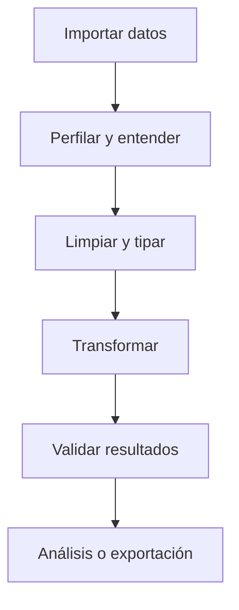

# Bloque 05 - Pandas: manipulación de datos

## Objetivo

Importar, limpiar, transformar y combinar tablas de datos con Pandas.

## El ciclo de preparación

Un DataFrame representa una tabla con filas y columnas etiquetadas. La primera tarea no es transformar: es inspeccionar tamaño, tipos, nulos, duplicados, rangos y ejemplos reales.

## Operaciones esenciales

- Seleccionar columnas y filtrar filas con condiciones.
- Convertir fechas, números y categorías explícitamente.
- Crear columnas derivadas con operaciones vectorizadas.
- Agrupar con `groupby` para resumir por segmento.
- Combinar fuentes con `merge`, verificando la cardinalidad de las claves.

## Uniones sin sorpresas

Antes de unir tablas identifica la clave y pregunta si es uno a uno, uno a muchos o muchos a muchos. Una unión inesperadamente muchos a muchos multiplica filas y puede inflar ingresos, usuarios o eventos.

## Validación

Después de una transformación compara número de filas, nulos y totales relevantes. Las validaciones simples son una red de seguridad más valiosa que un notebook elegante.

## Práctica

Resuelve [la limpieza de pedidos](../../ejercicios/temario-05/aplicacion/limpieza-pedidos.md) y después consulta [la solución razonada](../../soluciones/temario-05/limpieza-pedidos.md).
