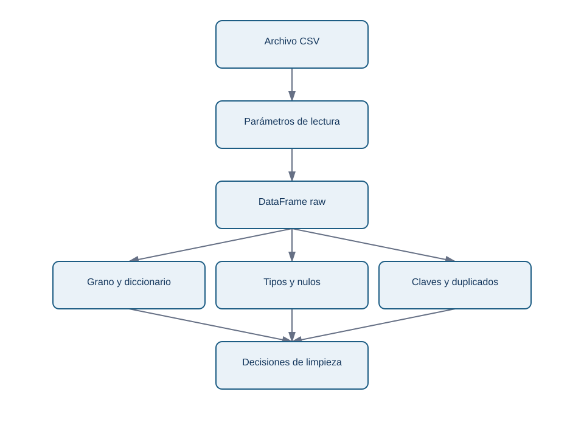
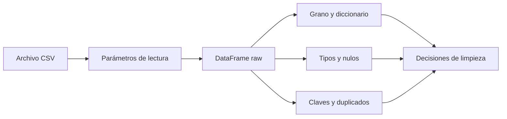

# 01 - Importar y perfilar una tabla

## Objetivo y prerrequisitos

Al terminar podrás explicar qué representa una fila de un CSV, cargarla con parámetros deliberados y producir un perfil inicial antes de calcular una métrica. Requiere saber que una tabla tiene filas y columnas.

## Del archivo a una tabla en memoria

Imagina un archivo de texto con estas dos líneas:

```text
pedido_id;fecha_pedido;importe_bruto
P-1001;2026-06-03;29,90
```

Un **CSV** es un archivo de texto que separa valores; su nombre histórico dice «comma-separated», pero aquí el separador es `;`. No lleva una garantía de tipos: `29,90` llega como caracteres, no como dinero. Un **DataFrame** es la tabla que Pandas mantiene en memoria; una **Series** es una sola columna, con un valor por fila y un índice que identifica su posición.

En Nébula una fila de `pedidos_nebula.csv` pretende representar **un pedido creado**. Esa frase es el *grano*: si una fila fuese una línea de producto, sumar importes o contar pedidos cambiaría de significado.

```python
from pathlib import Path
import pandas as pd

datos = Path("datasets/pandas")
pedidos_raw = pd.read_csv(
    datos / "pedidos_nebula.csv",
    sep=";",
    encoding="utf-8",
    na_values=["", "NA", "sin dato"],
    dtype={"pedido_id": "string", "cliente_id": "string", "canal": "string"},
)
```

`dtype` protege identificadores: un ID no es una cantidad y no se debe convertir en número. Las fechas y los importes se convertirán después, de forma visible, porque primero interesa descubrir qué valores no cumplen el formato.

El diagrama responde a «¿qué debo saber antes de transformar una exportación?»:

<!-- mobile-diagram: rendered fallback -->


<details>
<summary>Ver código Mermaid editable</summary>


</details>

La importación no es todavía limpieza. Produce una versión `raw` que se conserva para poder explicar de dónde salió cualquier fila descartada.

## Perfil mínimo que evita errores caros

Antes de preguntar «¿qué canal vende más?» pregunta qué llegó:

```python
print(pedidos_raw.head(3))
print(pedidos_raw.shape)
print(pedidos_raw.dtypes)
print(pedidos_raw.isna().sum())
print(pedidos_raw["pedido_id"].duplicated().sum())
print(pedidos_raw["estado"].value_counts(dropna=False))
```

`head()` ofrece ejemplos, no prueba calidad. `shape` permite detectar una carga incompleta. `isna().sum()` cuenta ausencias por columna. `value_counts(dropna=False)` muestra tanto categorías inesperadas como nulos; sin `dropna=False` podríamos no ver que falta un estado.

Un perfil profesional también define un pequeño diccionario: `pedido_id` es la clave esperada, `fecha_pedido` es la fecha de creación en UTC, `importe_bruto` está en EUR y `estado` decide si el pedido entra en ingresos. No basta con que los nombres «suenen bien».

## Error habitual y límite

Un error frecuente es usar `pd.read_csv("pedidos.csv")` y continuar porque no dio excepción. Si el fichero usa `;`, Pandas puede construir una sola columna enorme; si usa coma decimal, el importe puede quedar como texto. La carga técnicamente correcta no demuestra que la semántica sea correcta.

Otra falsa seguridad es hacer `parse_dates` y asumir que todo se interpretó. En datos no estándar o mezclados es preferible convertir luego con `pd.to_datetime(..., errors="coerce")`, medir los fallos y decidir qué hacer con ellos.

## Resumen y comprobación

- CSV describe una forma de separar texto; DataFrame es la tabla en memoria.
- Grano, clave y unidades se declaran antes de agregar.
- El perfil mide lo que llegó; no lo corrige a escondidas.

1. ¿Por qué `pedido_id` debe leerse como texto aunque contenga dígitos?
2. Si aparecen 500 filas en lugar de 50 000, ¿qué comprobarías antes de concluir que hubo menos pedidos?

Sigue con [selección, tipos y limpieza](02-seleccion-tipos-y-limpieza.md).
