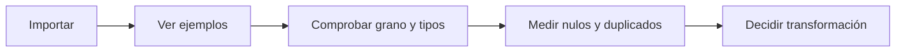

# DataFrames, importación y perfilado

## Objetivos y prerrequisitos

Sabrás abrir una tabla con Pandas e inspeccionarla antes de modificarla. Requiere los bloques de datos y Python.

Un **DataFrame** es una tabla en memoria: filas (observaciones) y columnas (variables) con nombres. Un archivo CSV puede guardar una tabla, pero abrirlo no garantiza que cada columna tenga el tipo ni el significado esperado.

```python
import pandas as pd
pedidos = pd.read_csv("pedidos.csv")
pedidos.head()
pedidos.info()
```

`head()` muestra ejemplos; `info()` enseña número de filas, columnas, tipos y valores no nulos. Compleméntalos con `describe()`, revisión de categorías y comprobación del grano: ¿una fila representa un pedido, una línea de pedido o un usuario?

Este flujo responde a “¿qué debe ocurrir antes de calcular?”



Un error habitual es llamar “ventas” a una columna sin verificar moneda, impuestos o devoluciones. El perfilado abre preguntas; no las responde automáticamente.

Sigue con [selección, tipos y limpieza](02-seleccion-tipos-y-limpieza.md).
