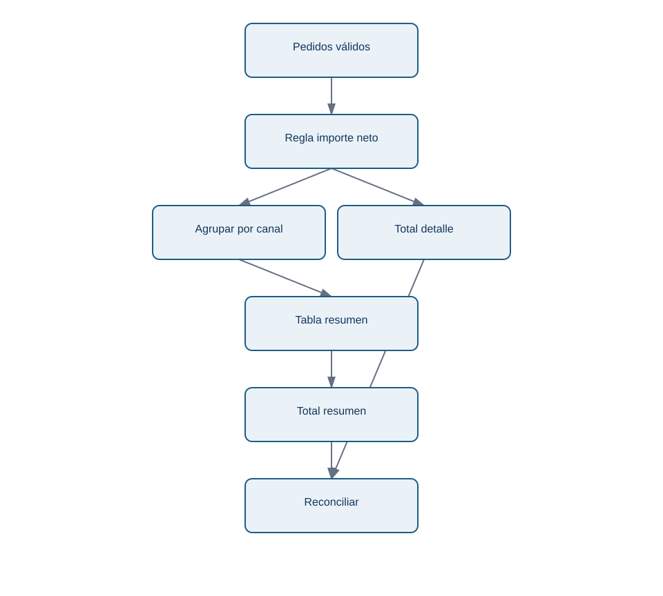
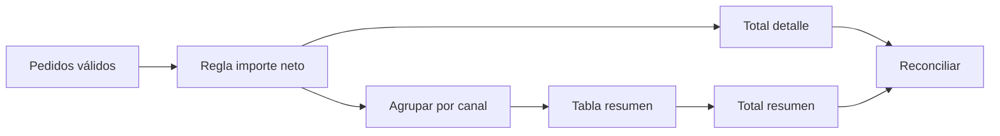

# 03 - Transformar, agrupar y reconciliar una métrica

## Objetivo y prerrequisitos

Construirás ingresos netos por canal sin perder la relación con cada pedido. Requiere una tabla de pedidos válida y saber que el grano actual es un pedido.

## Una columna derivada es una regla, no una fórmula suelta

Nébula quiere ingresos netos de pedidos pagados. El contrato acordado es: importe bruto menos descuento, en EUR, por pedido creado en junio; no representa margen ni ingresos tras devoluciones futuras.

```python
pedidos_validos = pedidos_validos.assign(
    importe_neto=lambda tabla: tabla["importe_bruto"] - tabla["descuento"]
)
assert pedidos_validos["importe_neto"].ge(0).all()
```

`assign` devuelve una nueva tabla y el `lambda` deja claro que la regla usa las columnas de esa misma tabla. El `assert` verifica un supuesto; si falla, debemos mirar las filas, no cambiar el umbral para que el programa continúe.

## De detalle a resumen sin cambiar el denominador

`groupby` reúne filas con el mismo valor de una clave de agrupación. Después `agg` define con nombre qué resume cada columna:

```python
por_canal = (
    pedidos_validos.groupby("canal", as_index=False)
    .agg(
        pedidos=("pedido_id", "nunique"),
        ingresos_netos=("importe_neto", "sum"),
        ticket_medio=("importe_neto", "mean"),
    )
    .sort_values("ingresos_netos", ascending=False)
)
```

`nunique` cuenta pedidos distintos; `count` cuenta valores no nulos y `size` cuenta filas. Si aún hubiese dos registros para un pedido, `size` inflaría el volumen. El promedio no debe viajar solo: un canal con un único pedido caro puede tener el mayor ticket y aportar poco al total.

Este flujo responde a «¿cómo sé que el resumen no perdió o duplicó dinero?»:

<!-- mobile-diagram: rendered fallback -->


<details>
<summary>Ver código Mermaid editable</summary>


</details>

La reconciliación compara dos caminos que deberían coincidir:

```python
total_detalle = pedidos_validos["importe_neto"].sum()
total_resumen = por_canal["ingresos_netos"].sum()
assert total_detalle == total_resumen
```

En importes con muchos decimales se usaría `math.isclose`, porque la representación binaria de `float` puede introducir diferencias minúsculas. Para facturación real, la unidad monetaria y el redondeo se acuerdan con finanzas; no se resuelven solo con Python.

## Error habitual y pregunta analítica

Agrupar por canal responde una pregunta descriptiva: «¿cómo se distribuyen los ingresos observados?». No demuestra que el canal haya causado la venta: web, app y partner pueden atraer clientes distintos. También puede ocultar país, campaña o periodo; por eso una segunda agrupación debe añadir una hipótesis, no columnas por costumbre.

## Resumen y comprobación

- Una medida derivada lleva definición, unidad, población y límite.
- La función de conteo debe coincidir con el grano.
- Reconciliar es comparar el detalle con el resumen antes de publicar.

1. ¿Cuándo usarías `size` en lugar de `nunique`?
2. ¿Por qué la igualdad entre totales no demuestra por sí sola que los estados incluidos sean correctos?

Sigue con [uniones y cardinalidad](04-uniones-y-cardinalidad.md).
