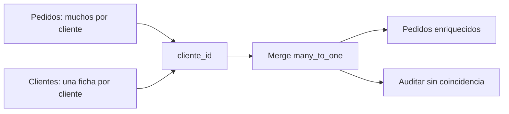

# 04 - Unir tablas y proteger la cardinalidad

## Objetivo y prerrequisitos

Enriquecerás pedidos con el segmento de cliente sin multiplicar ingresos por accidente. Requiere conocer clave, grano y el resumen de la lección anterior.

## La pregunta que precede a `merge`

`pedidos` contiene muchos pedidos por `cliente_id`; `clientes` debe contener una sola ficha vigente por cliente. Por tanto, la relación esperada es **muchos a uno**: muchos pedidos encuentran un cliente. Una unión combina columnas mediante una clave; no es una prueba de que la clave represente a la misma persona en ambos sistemas.



`how="left"` conserva todas las filas del lado izquierdo, importante cuando un pedido no encuentra cliente: ocultarlo convertiría un problema de cobertura en una aparente mejora de calidad.

```python
clientes = pd.read_csv(datos / "clientes_nebula.csv", sep=";", dtype="string")
assert clientes["cliente_id"].is_unique

enriquecidos = pedidos_validos.merge(
    clientes[["cliente_id", "segmento", "pais"]],
    on="cliente_id",
    how="left",
    validate="many_to_one",
    indicator=True,
)
print(enriquecidos["_merge"].value_counts())
```

`validate` hace fallar el código si `clientes` contiene la misma clave dos veces. `_merge` clasifica el resultado: `both` coincidió, `left_only` no encontró ficha. La elección de excluir `left_only` depende de la métrica: para ingresos de pedidos suele conservarse el pedido y se etiqueta su segmento como desconocido; para analizar segmentación se comunica la cobertura.

## Cardinalidades y contraejemplo

- **uno a uno:** una fila de cada lado por clave;
- **uno a muchos:** una cuenta tiene muchos eventos;
- **muchos a uno:** muchos pedidos pertenecen a un cliente;
- **muchos a muchos:** cada clave se repite en ambos lados. Puede ser válido en una tabla puente, pero multiplica combinaciones.

Si el archivo de clientes tuviera dos fichas para `C-10`, un pedido de 40 EUR podría salir dos veces tras el merge y convertirse falsamente en 80 EUR. La conciliación de la lección 03 debe ejecutarse otra vez después de cada unión que afecte a las filas.

## Resumen y comprobación

- Declara cardinalidad y `how` antes de escribir el merge.
- `validate` protege el supuesto; `indicator` mide cobertura.
- Una unión correcta en sintaxis puede ser errónea en negocio.

1. ¿Por qué un `inner` merge puede ocultar pedidos importantes?
2. ¿Qué tabla adicional necesitarías para modelar correctamente una relación muchos a muchos entre pedidos y productos?

Sigue con [contrato, validación y linaje](05-validacion-y-trazabilidad.md).
