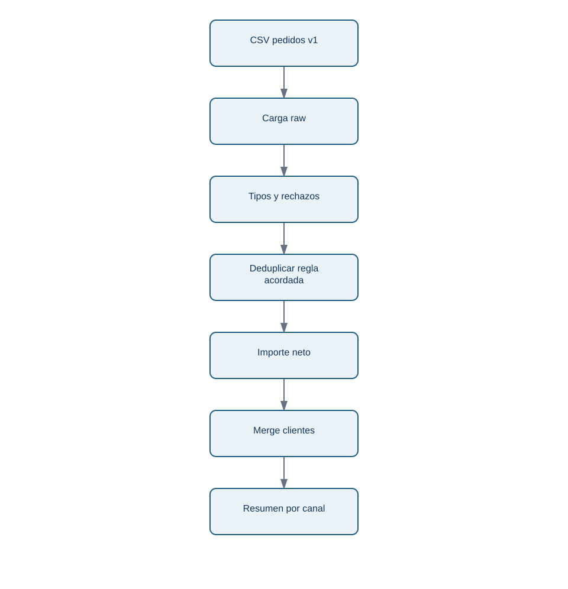
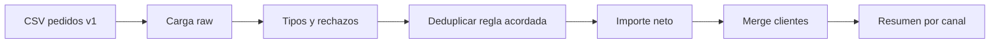

# 05 - Contrato de datos, validación y linaje

## Objetivo y prerrequisitos

Convertirás expectativas sobre los datos en controles y describirás el camino desde un archivo fuente hasta un resultado. Requiere el pipeline de las lecciones anteriores.

## El contrato evita que «limpio» sea una opinión

Un **contrato de datos** es un acuerdo comprobable entre quien publica y quien consume una tabla. No tiene que ser una plataforma compleja: para `pedidos_nebula` basta documentar el grano, clave, columnas, tipos, rangos, categorías permitidas, zona horaria, actualización y propietario.

| Elemento | Contrato de Nébula |
| --- | --- |
| Grano | Un pedido creado; la última extracción prevalece por `pedido_id`. |
| Clave | `pedido_id`, única tras deduplicar. |
| Importe | EUR, bruto, mayor o igual que cero. |
| Fecha | ISO `YYYY-MM-DD`, creación del pedido, UTC. |
| Estados válidos | `pagado`, `pendiente`, `cancelado`. |
| Propietario | Equipo de pagos; revisión diaria. |

Cada regla se comprueba cerca de la transformación que la necesita:

```python
def comprobar_pedidos(tabla: pd.DataFrame) -> None:
    requeridas = {"pedido_id", "cliente_id", "fecha_pedido", "importe_neto", "canal"}
    assert requeridas.issubset(tabla.columns), "Faltan columnas del contrato"
    assert tabla["pedido_id"].is_unique, "Un pedido aparece más de una vez"
    assert tabla["fecha_pedido"].notna().all(), "Hay fechas no interpretables"
    assert tabla["importe_neto"].ge(0).all(), "Hay importes netos negativos"
```

Un `assert` es adecuado para un pipeline educativo o una comprobación interna. En producción debe convertirse en una señal con contexto: número de filas, muestra segura de claves, versión de fuente y decisión de detener, avisar o aislar datos.

## Linaje: poder responder «¿de dónde sale este número?»

El **linaje** registra origen, transformaciones y salida. El diagrama responde esa pregunta para ingresos por canal:

<!-- mobile-diagram: rendered fallback -->


<details>
<summary>Ver código Mermaid editable</summary>


</details>

Junto a cada ejecución conserva: fecha/hora de extracción, ruta o identificador de versión, conteo de entrada, rechazos por motivo, filas de salida y total reconciliado. No guardes datos personales innecesarios en el registro; IDs y muestras deben tratarse según la política de privacidad.

## Límite y resumen

Pasar validaciones no prueba que una métrica sea útil: podría cumplir el contrato y medir la fecha de creación cuando dirección quería fecha de cobro. El contrato aclara y detecta desviaciones; la decisión de negocio sigue necesitando dueño y contexto.

- El contrato define lo que se espera antes de ejecutar código.
- Las validaciones protegen supuestos de grano, tipos y rangos.
- El linaje permite repetir y auditar una cifra.

1. ¿Qué dato mínimo guardarías para explicar por qué cambiaron los ingresos de ayer?
2. ¿Qué regla del contrato no puede inferir Pandas y debe acordarse con negocio?

Aplica el flujo en el [laboratorio integrado](06-caso-integrado-pedidos.md).
