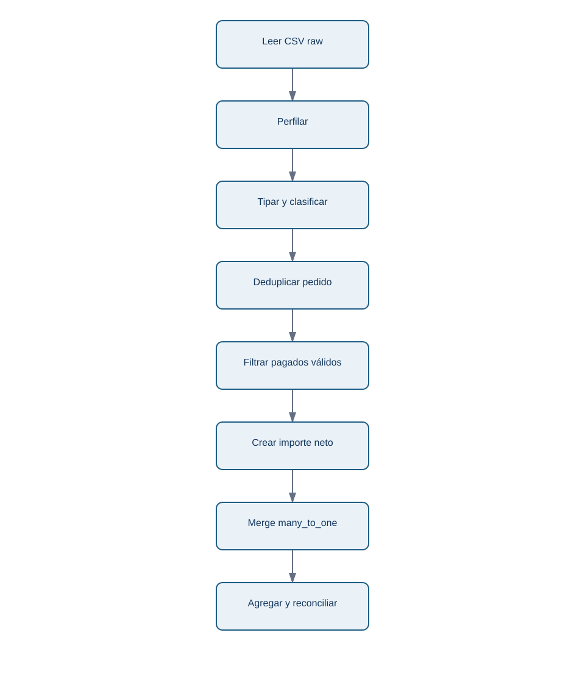
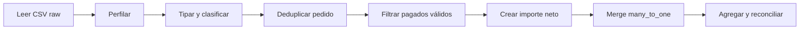

# 06 - Laboratorio: pipeline de pedidos de Nébula

## Objetivo y entrega

Ejecuta [05-pipeline-pedidos-nebula.py](../../../notebooks/practicas/05-pipeline-pedidos-nebula.py). El script no descarga nada: lee los dos CSV del repositorio, muestra los perfiles, aisla rechazos, deduplica de forma explícita, calcula ingresos netos, une clientes y reconcilia el resumen.

La pregunta de negocio es: **«en la extracción de junio, ¿cuántos pedidos pagados válidos e ingresos netos observamos por canal, y qué cobertura tiene la segmentación de clientes?»**. La respuesta no es margen, LTV ni causalidad de canal.

## Secuencia de trabajo

<!-- mobile-diagram: rendered fallback -->

Ver código Mermaid editable

Al ejecutar, revisa especialmente tres decisiones: una fecha inválida se rechaza en vez de inventarse; una actualización duplicada de `P-1002` se resuelve por fecha de extracción; un cliente sin ficha se conserva en ingresos y se declara como cobertura incompleta.

## Resultados esperados y lectura profesional

El resultado debe imprimir `Ingresos por canal`, un total de detalle igual al total del resumen y una tabla de `both`/`left_only`. Si cambias una regla, por ejemplo incluyes pendientes, no basta con que el script termine: modifica la definición de la métrica, vuelve a conciliar y explica el impacto.

Un pipeline pequeño es ya una entrega profesional si otra persona puede ejecutarlo, entender sus supuestos y detectar qué datos quedaron fuera. La automatización no sustituye a confirmar que pagos, devoluciones y moneda corresponden a la decisión.

Después resuelve [la auditoría de pedidos](../../../ejercicios/temario-05/aplicacion/auditoria-pedidos-nebula.md). El bloque 06 utilizará esta tabla trazable para explorar patrones; no convertirá una diferencia entre canales en una explicación causal.
