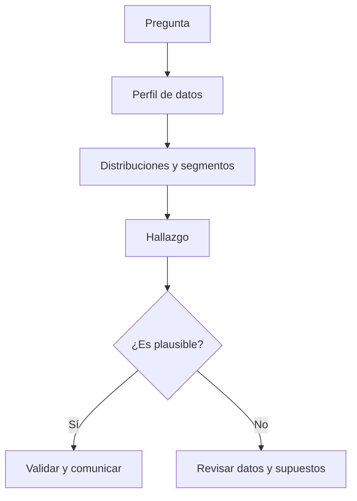

# Bloque 06 - Análisis exploratorio de datos

## Objetivo

Explorar datos de manera rigurosa para descubrir patrones, anomalías y preguntas nuevas sin confundir exploración con demostración causal.

## Preguntas antes de gráficos

Empieza por una hipótesis o pregunta: "¿qué segmento ha cambiado?", "¿dónde se concentran los valores atípicos?", "¿hay estacionalidad?". Un gráfico sin pregunta puede ser interesante, pero no necesariamente útil.

## Distribución y segmentos

Observa centro, dispersión, asimetría y valores extremos. Compara siempre segmentos relevantes: una media global puede ocultar que un canal crece mientras otro cae. No borres outliers sin investigar si representan un error, un caso importante o una población distinta.

## Correlación y causalidad

Dos variables pueden moverse juntas por azar, por una tercera causa o porque una afecta a la otra. El EDA genera hipótesis; experimentos, diseños causales o conocimiento del proceso ayudan a evaluar explicaciones.

## Registro de decisiones

Anota filtros, exclusiones, transformaciones y limitaciones. Un buen análisis permite responder no solo "qué encontraste", sino "cómo llegaste ahí".

## Práctica

Resuelve [la investigación de una caída](../../ejercicios/temario-06/aplicacion/investigar-caida.md) antes de mirar [la guía de solución](../../soluciones/temario-06/investigar-caida.md).
