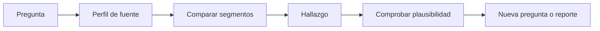

# Preguntas y perfil exploratorio

## Objetivos y prerrequisitos

Convertirás un conjunto de datos en preguntas de exploración y comprobarás si la fuente puede responderlas. Requiere manejo básico de Pandas.

El análisis exploratorio, o **EDA**, es una investigación abierta pero disciplinada. No empieza con “haz todos los gráficos”; empieza con una pregunta como “¿en qué segmento se concentra la caída de pedidos?” y con un perfil de grano, periodo, cobertura, nulos y duplicados.

El hallazgo genera una hipótesis, no un veredicto. Si faltan datos de dispositivo, no concluyas que no importa: concluye que la fuente no permite evaluarlo.

## Resumen

El EDA limita el espacio de dudas con evidencia visible. Sigue con [distribuciones y segmentos](02-distribuciones-segmentos-y-outliers.md).
