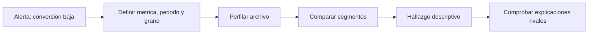

# Lección 01 - De una alerta a una pregunta y un perfil reproducible

## Objetivo y prerrequisitos

Convertirás una alerta de negocio en una pregunta que los datos puedan responder parcialmente y crearás el primer perfil de su fuente. Requiere saber leer un CSV con Pandas.

## El problema antes de la técnica

«La conversión ha caído» no basta para analizar. ¿Conversión de qué evento a qué evento? ¿En qué fechas, países o plataformas? Si mezclamos esos significados, podemos comparar semanas incompletas o sumar personas con sesiones y llamar al resultado «conversión».

En Nébula, una fila representa el agregado de un `día`, `plataforma` y `canal`. La métrica de esa fila es `compras / visitas`. La pregunta inicial es: **¿la caída de conversión entre el 5 y el 11 de mayo está concentrada en algún segmento y el archivo permite investigarla?** No pregunta todavía por una causa.



El diagrama responde al orden de trabajo: primero definimos qué mide cada fila; después miramos patrones. Un gráfico bonito hecho antes del perfil puede estar describiendo una fuente defectuosa.

## Qué es perfilar una fuente

Un *perfil* es una ficha de salud y significado del conjunto. Antes de calcular medias, revisa:

- **Esquema:** nombres y tipo esperado de cada columna. `fecha` debe ser fecha, `visitas` y `compras` números enteros no negativos; `plataforma` y `canal` categorías.
- **Grano:** qué representa exactamente una fila. Aquí no es una persona ni una compra: es un resumen diario por segmento.
- **Cobertura:** primera y última fecha, días ausentes y combinaciones de segmentos que faltan.
- **Calidad:** nulos, duplicados, valores imposibles y cambios de definición o de tracking.
- **Semántica:** de dónde procede el dato y qué cuenta como visita o compra.

Un nulo significa que falta un valor; un cero significa que se registró una cantidad cero. Son cosas distintas: cambiar uno por otro sin comprobarlo inventa evidencia.

## Ejemplo trabajado: el primer perfil

```python
import pandas as pd

datos = pd.read_csv("datasets/nebula_checkout_mayo.csv", parse_dates=["fecha"])
print(datos.shape)
print(datos.dtypes)
print(datos.isna().sum())
print(datos.duplicated().sum())
print(datos.groupby("plataforma").size())
print(datos[["fecha", "visitas", "compras"]].describe())
```

El resultado no responde aún a la alerta. Sí verifica si podemos confiar en el punto de partida. Además, una clave de unicidad razonable es `(fecha, plataforma, canal)`: si aparece dos veces, no conviene sumar ambas sin saber si son duplicados o correcciones.

## Error habitual: usar el promedio de porcentajes

Si Android tuvo 1 compra de 10 visitas (10 %) y web 10 compras de 1.000 visitas (1 %), el promedio simple es 5,5 %. La conversión real conjunta es 11 / 1.010 = 1,09 %. Para combinar tasas, suma primero numeradores y denominadores; luego divide.

## Resumen y comprobación

Una pregunta útil nombra métrica, población, periodo y comparación. Un perfil documenta si el archivo representa esa pregunta.

1. ¿Qué representa una fila del caso Nébula?
2. ¿Por qué un valor cero no debe tratarse automáticamente como nulo?
3. ¿Qué clave usarías para buscar duplicados y por qué?

Sigue con [distribuciones y segmentación](02-distribuciones-segmentos-y-outliers.md).
