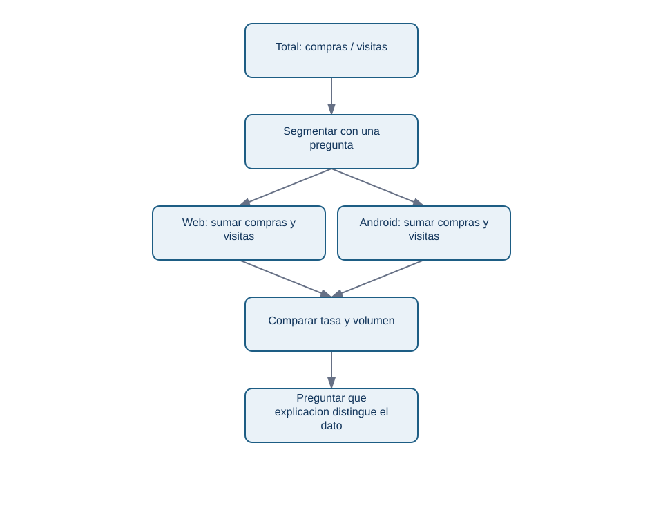
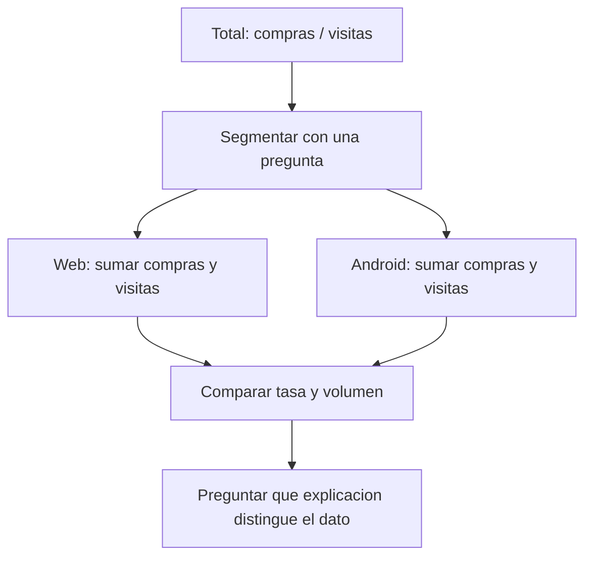

# Lección 02 - Distribuciones, denominadores y segmentación

## Objetivo

Describirás cómo se reparten los datos y compararás segmentos sin perder de vista cuántas observaciones los sostienen.

## De una cifra a una distribución

La *distribución* muestra qué valores aparecen y con qué frecuencia. La media responde «cuál sería el reparto igualitario»; la mediana es el valor central al ordenar; los percentiles indican umbrales. Si los importes de pedidos son 8, 10, 11, 12 y 800 euros, la media (168,2) describe mal a la mayoría; la mediana (11) la representa mejor. No hay un resumen universal: depende de la pregunta.

Para conversiones diarias conviene observar al menos el mínimo, mediana, máximo y volumen de visitas. Una tasa de 0 % con dos visitas puede ser ruido; una tasa de 0 % con 20.000 visitas exige investigación.

## Segmentar es comparar poblaciones, no decorar una tabla

Un *segmento* es un subconjunto definido antes de mirar el resultado: por plataforma, canal, país o versión. En Nébula, `plataforma` divide los datos entre web y Android. Calculamos una tasa agregada correcta:

```python
resumen = (
    datos.groupby("plataforma", as_index=False)
    .agg(visitas=("visitas", "sum"), compras=("compras", "sum"))
)
resumen["conversion"] = resumen["compras"] / resumen["visitas"]
```

<!-- mobile-diagram: rendered fallback -->


<details>
<summary>Ver código Mermaid editable</summary>


</details>

El diagrama muestra que los segmentos son ramas paralelas: no debemos sumar sus porcentajes ni tratarlos como pasos de una secuencia.

## Ejemplo: caída localizada

Compara el 5-11 de mayo con el periodo anterior, pero mantén los denominadores:

```python
datos["semana"] = datos["fecha"].between("2025-05-05", "2025-05-11").map(
    {True: "actual", False: "referencia"}
)
tabla = datos.groupby(["semana", "plataforma"]).agg(
    visitas=("visitas", "sum"), compras=("compras", "sum")
)
tabla["conversion"] = tabla["compras"] / tabla["visitas"]
print(tabla)
```

Si Android cae y web permanece estable, el hallazgo es «la caída observada se concentra en Android, dentro de este archivo». No es «Android causó la caída»: Android es un lugar donde mirar versión, errores y eventos de tracking.

## Límites y preguntas

Un segmento pequeño puede variar por azar y un segmento grande puede ocultar grupos internos distintos. Evita probar decenas de cortes hasta encontrar uno llamativo: registra qué comparaciones responden a la pregunta inicial. En el bloque 08 aprenderás a cuantificar incertidumbre.

1. ¿Por qué una tasa siempre necesita su denominador?
2. ¿Cuándo preferirías la mediana a la media?
3. ¿Qué segmento pedirías antes de concluir que una campaña funcionó?

El siguiente paso es decidir qué hacer con un valor muy raro sin convertirlo automáticamente en un error.
