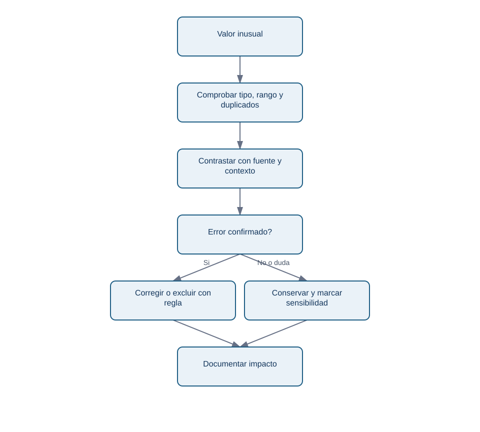
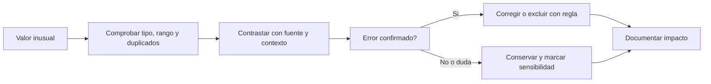

# Lección 03 - Valores extremos: investigar antes de borrar

## Objetivo

Aprenderás a distinguir un valor raro, un error de calidad y un caso de negocio importante, y a dejar una decisión reproducible.

## Un outlier no es un permiso para eliminar

Un *valor extremo* u *outlier* es una observación alejada del patrón de referencia. Puede ser un fallo de medición (visitas negativas), un cambio legítimo (una campaña con mucho tráfico), fraude, una unidad equivocada o un cliente relevante. El dato no trae pegada la etiqueta «error».

En Nébula, un día con muchas visitas y compras cero puede señalar un checkout roto, un evento de compra que dejó de llegar o tráfico no humano. Borrarlo haría el promedio más agradable, pero podría ocultar justo la incidencia que buscamos.

## Protocolo de investigación

<!-- mobile-diagram: rendered fallback -->


<details>
<summary>Ver código Mermaid editable</summary>


</details>

La decisión tiene dos salidas legítimas. Solo se excluye después de confirmar el motivo; si hay duda, se conserva y se explica cómo cambia el resultado con y sin ese caso.

## Reglas cuantitativas como alarma, no sentencia

El rango intercuartílico (IQR) usa el percentil 25, `Q1`, y el 75, `Q3`: una regla común marca como candidata a revisión una observación menor que `Q1 - 1,5 x IQR` o mayor que `Q3 + 1,5 x IQR`. Es una forma de priorizar una revisión, no una prueba de error. En variables con colas largas -como gasto o tráfico de campañas- marcará muchos casos legítimos.

```python
q1 = datos["visitas"].quantile(0.25)
q3 = datos["visitas"].quantile(0.75)
iqr = q3 - q1
candidatos = datos[datos["visitas"] > q3 + 1.5 * iqr]
```

También comprueba reglas de negocio claras: `compras > visitas` es imposible si ambos eventos se miden en la misma población; una fecha futura puede ser un error de carga; una categoría nueva puede ser un cambio de producto, no un valor inválido.

## Registro de una exclusión

Una regla defendible dice: «Se excluye la fila de Android/ads del 08-05 del cálculo de conversión porque el equipo de instrumentación confirmó que `compras` no se exportó ese día. Se conserva en la tabla fuente y se publica el resultado con y sin la corrección». «Quité los datos raros» no es reproducible.

## Comprobación

1. ¿Qué evidencia pedirías antes de borrar un día de conversión cero?
2. ¿Qué diferencia hay entre una regla de detección y una decisión de exclusión?
3. ¿Por qué conservarías una fila conocida como errónea en la fuente original?

Sigue con [relaciones, causalidad y paradoja de Simpson](04-relaciones-correlacion-y-causalidad.md).
