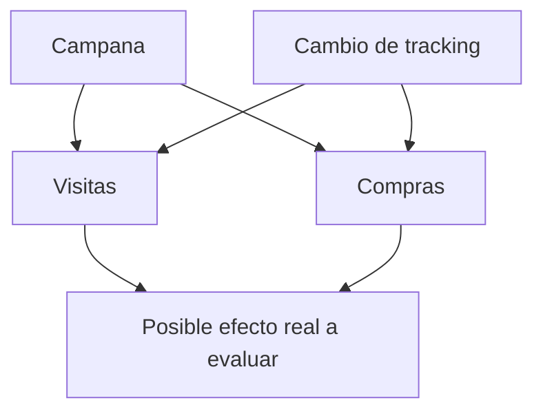

# Lección 04 - Relaciones, correlación, causalidad y paradoja de Simpson

## Objetivo

Separarás lo que los datos observacionales muestran de lo que sería necesario para atribuir una causa.

## Cuatro afirmaciones que no significan lo mismo

- **Observación:** «La conversión de Android fue menor esta semana». Es una descripción del archivo y su periodo.
- **Asociación:** «Los días con más errores de pago coinciden con menor conversión». Dos variables cambian juntas.
- **Predicción:** «Con los datos disponibles, el número de errores ayuda a anticipar conversión». Puede ser útil sin ser causal.
- **Causalidad:** «Reducir errores de pago aumentará conversión». Requiere un diseño que descarte explicaciones alternativas.

La *correlación* mide una forma de asociación lineal; no es una flecha de causa. Una campaña puede aumentar a la vez visitas y compras. La correlación entre ambas no demuestra que una visita concreta haya causado una compra ni que aumentar tráfico de baja calidad funcione.

El diagrama formula explicaciones rivales: campaña y tracking pueden producir un patrón parecido. El EDA permite encontrarlas; un experimento, un análisis causal o una investigación técnica decide entre ellas.

## Paradoja de Simpson: el total puede engañar

Imagina que la conversión total parece caer. Al dividir por plataforma, web mejora y Android mejora, pero Android recibe una proporción mucho mayor de tráfico que web y normalmente convierte peor. El cambio de mezcla puede hacer que el total baje aun cuando cada plataforma mejore. Esto es una versión de la *paradoja de Simpson*: una tendencia agregada puede invertirse al estratificar por una variable que cambia la composición.

Por eso la pregunta «¿qué segmentos cambian su peso?» acompaña a «¿qué tasa cambia?». No significa segmentar hasta obtener la respuesta deseada; significa elegir variables que representen poblaciones distintas y mostrar siempre el total y los tamaños.

## Comprobación práctica

Para cada explicación rival, escribe qué observación la haría más o menos plausible:

| Explicación | Evidencia que buscar |
| --- | --- |
| Checkout roto en Android | errores de pago y abandono aumentan solo tras la versión afectada |
| Cambio de mezcla de tráfico | cambia el peso de canales/plataformas, con tasas internas estables |
| Tracking incompleto | caen eventos de compra, pero pagos confirmados en la pasarela no |

## Resumen

El lenguaje responsable dice «consistente con», «concentrado en» o «requiere comprobar». En la siguiente lección convertirás esa prudencia en una recomendación accionable.
